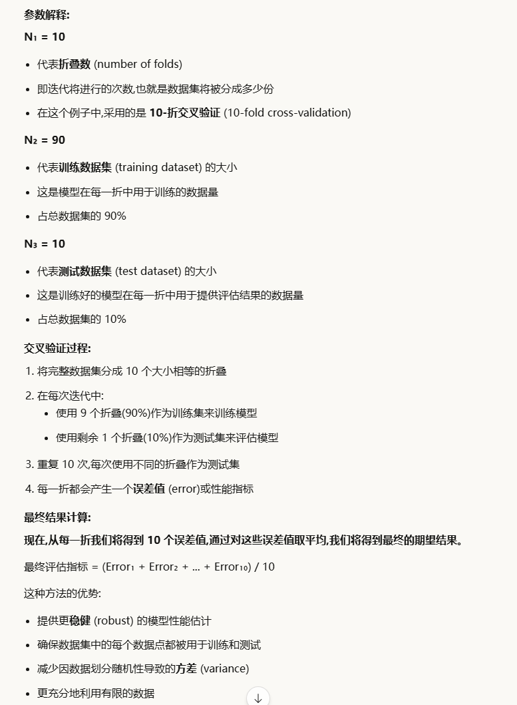

# ==1.confusion matrix==
## 基本结构

对于二分类问题，混淆矩阵是一个2×2的表格：

```
                预测为正类    预测为负类
实际为正类        TP           FN
实际为负类        FP           TN
```

**四个关键指标：**

- **TP (True Positive)**：真正例 - 实际为正类，预测也为正类
- **TN (True Negative)**：真负例 - 实际为负类，预测也为负类
- **FP (False Positive)**：假正例 - 实际为负类，但预测为正类（第一类错误）
- **FN (False Negative)**：假负例 - 实际为正类，但预测为负类（第二类错误）

## 衍生指标

从混淆矩阵可以计算出多个评估指标：

**准确率 (Accuracy)** = (TP + TN) / (TP + TN + FP + FN)

**精确率 (Precision)** = TP / (TP + FP) - 预测为正类中真正为正类的比例

**召回率 (Recall/Sensitivity)** = TP / (TP + FN) - 实际正类中被正确识别的比例

**F1分数** = 2 × (Precision × Recall) / (Precision + Recall)


# ==2. 预测性分析和规范性分析==
是数据分析成熟度模型 (analytics maturity model) 中的高级阶段:

1. **描述性分析** (Descriptive Analytics) - 发生了什么?
2. **诊断性分析** (Diagnostic Analytics) - 为什么发生?
3. **预测性分析** (Predictive Analytics) - 将会发生什么?
4. **规范性分析** (Prescriptive Analytics) - 某种情况下应该怎么办


# ==3. REST API==

### 创建api
URI design：使用名词nouns (plurals)
在资源URI上添加'动作/动词'来完成API端点
正确且一致地使用状态码，帮助客户端更好理解交互

HATEOAS = Hypermedia As The Engine Of Application State
**客户端不需要硬编码 URL，而是通过服务器返回的链接（超媒体）来导航**

### 消费api

**"客户端是预先编写的软件程序"** - 这意味着需要专门开发 REST 客户端代码来与 API 交互。

### 单页应用（SPA）的基本结构

**REST客户端应用可以设计成一个简单、重复的循环**：

**基本循环**：

1. 执行HTTP请求
2. 将响应（JSON）存储在内存中
3. 检查响应以获取当前上下文
4. 遍历响应并在屏幕上渲染与上下文相关的信息


### Must Ignore 原则

**定义**：

> HTTP指令"MUST IGNORE" = 接收方不理解的响应中的任何元素必须被忽略，而不停止对响应的进一步处理。

旧版本客户端收到新版本响应，包含新版本才有的字段，旧版本客户端不认识它，那么就应该直接忽略继续处理


# RESTful API security

### 安全定义

> "IT系统提供的安全可以定义为IT系统能够保护处理数据的**机密性**和**完整性**，提供系统和数据的**可用性**，为处理的事务提供**问责性**，以及**保证**系统将继续按照其设计目标运行。"

### 五个关键要素

**1. Confidentiality（机密性）**

- 保护数据不被未授权访问
- 只有授权用户能看到敏感信息

**2. Integrity（完整性）**

- 确保数据未被篡改
- 数据准确和完整

**3. Availability（可用性）**

- 系统和数据在需要时可访问
- 防止拒绝服务

**4. Accountability（问责性）**

- 追踪谁做了什么
- 审计和日志记录

**5. Assurance（保证）**

- 系统按设计目标持续运行
- 符合安全要求和标准

## Common API authentication options:
• HTTP Basic Authentication
每次发报传送base64编码（不是加密）的密码
不安全

• Token-based Authentication 
	用户输入登录凭证，服务器返回token
	token储存在localstorage
	后续请求带token给服务器验证

JWT（JSON WEB TOKEN）
Header Payload Signature


• API Key `[+ Signature] 
	为用户签发api key
	用户在后续请求中附带api key


• OAuth (Open Authorisation) Protocol
用户在Gmail授权页面登录
Gmail询问：允许Facebook访问你的联系人吗？
用户点击"允许"
Gmail给Facebook一个访问令牌（access token）
Facebook用这个令牌访问联系人
关键：Facebook从未看到Gmail密码


REST API安全方法：
rate limiting 限流
input validation输入校验：防止注入攻击
Audit logs审计日志：记录访问行为，方便排查异常活动


# ==4. K-NN

非参数（不对函数形式进行假设，避免底层建模错误）
基于实例（算法不显式学习模型，而是选择记忆训练实例，这些实例随后被用作预测阶段的"知识"）
==**k-NN就是：找训练数据中最像的k个样本，看它们多数是什么类别，就预测为什么类别。


k值越大 → 决策边界越平滑 → 泛化能力越强
k值越小，决策边界越复杂，越容易过拟合

使用情景：大量训练数据
优点：训练非常快
学习复杂的目标函数
不丢失信息
缺点：查询慢
容易被不相干属性干扰


# 5.交叉验证
n1：折叠数
n2：训练集大小
n3：测试集大小



# ==5. 推荐系统==
推荐系统：输入用户模型信息，输出相关性分数（用于排序推荐结果）

==三种主要推荐系统的特点、优势和局限性：==
## 一、协同过滤 (Collaborative Filtering)

### **核心思想**

"Tell me what's popular among my peers"（告诉我同类人喜欢什么）

**最主流的推荐方法**

**基本假设：**

- 用户对目录物品评分（隐式或显式）
- ==过去口味相似=>未来也会有相似口味==
**方法**：
    - **基于用户**：找相似用户，用他们的评分预测
    - **基于物品**：找相似物品，用用户对这些物品的评分预测

|特性|基于用户|基于物品|
|---|---|---|
|相似度|用户间|物品间|
|稳定性|较低|较高|
|可扩展性|差|好（可预计算）|
|适用场景|用户少|物品少|


### **优势**

✓ 不需要物品内容信息 ✓ 完全基于用户行为 ✓ 能发现意外的推荐（用户可能没想到的） ✓ 利用"群体智慧"

### **局限性**

❌ **冷启动问题**：新用户/新物品没有足够评分 ❌ **数据稀疏性**：评分矩阵极度稀疏（Netflix仅1.8%非零） ❌ **流行度偏差**：倾向推荐热门物品，忽视长尾 ❌ **可扩展性**：用户/物品数量大时计算复杂


隐式评分：
网站自动收集用户的行为
但是无法确定行为是否被正确解释
因此需要显示+隐式评分结合使用

---

## 二、基于内容 (Content-based)

### **核心思想**

"Show me more of the same what I've liked"（给我看更多我喜欢的同类内容）
**基于内容推荐 = 物品特征匹配 + 用户偏好学习**
==**协同过滤：** 不需要物品信息 **基于内容：** 需要物品信息==
### **工作原理**

- ==**输入**：用户画像 + 产品特征（关键词、属性）==
- **方法**：计算未见物品与用户历史偏好的相似度
- **相似度计算**：Dice系数、余弦相似度等

### **优势**

✓ 解决新物品冷启动问题 ✓ 不依赖其他用户数据 ✓ 可解释性强（基于特征匹配） ✓ 用户偏好稳定时效果好

### **局限性**

❌ **关键词不足以判断质量/相关性**

- 无法评估时效性、美学、写作风格
- 多媒体内容难以自动提取

❌ **仍需要训练数据**

- 需要用户的历史评分/行为数据
- 新用户仍有冷启动问题

❌ **过度专业化（Overspecialization）**

- 只推荐与历史相似的内容
- 缺乏多样性和惊喜
- 陷入"过滤气泡"（Filter Bubble）

---

## 三、基于知识 (Knowledge-based)

### **核心思想**

"Tell me what fits based on my needs"（根据我的需求告诉我什么合适）

### **工作原理**

- **输入**：用户需求 + 产品特征 + 领域知识/规则
- **方法**：基于约束匹配和推理

### **优势**

✓ 解决冷启动问题（不依赖历史数据） ✓ 适合复杂决策（如房产、汽车） ✓ 可结合领域专家知识

### **局限性**

❌ 需要构建知识库（成本高） ❌ 难以捕捉个性化偏好 ❌ 维护困难


# 6. 数据处理

## 一、模式级数据质量问题 (Schema Level)

这类问题可以通过**更好的模式设计、模式转换和集成**来预防。

### 被关系数据库管理系统（RDBMS）避免的问题：

- **缺失数据** - 产品价格未填写
- **错误数据类型** - 产品价格中出现"abc"
- **错误数据值** - 产品税为0.5（应该是百分比）
- **悬空数据** - 产品的类别标识符不存在
- **重复数据** - 同一SSN对应不同的人
- **通用域约束** - 发票价格不正确

### 不能被RDBMS避免的问题：

- **错误分类数据** - 国家与对应州的对应关系错误
- **过时的时间数据** - 及时性要求问题
- **错误坐标数据** - 估算值和形状问题
- **名称冲突** - person vs person（人与个人）或person vs client（人与客户）
- **结构冲突** - 地址问题

## 二、实例级数据质量问题 (Instance Level)

这类问题是**数据中的错误和不一致**，无法在模式层面预防。

### 单条记录问题：

- **非空字段缺失数据** - ssn: 999999（社保号为999999）
- **错误数据** - price: 5，实际价格应为50
- **拼写错误** - Morty Al-Banna vs Morty Al-Banana
- **嵌入值** - dr. Morty Al-Banna（博士头衔嵌入名字中）
- **标签错误字段** - city: Australia（城市字段填成了国家）
- **歧义数据** - M Al-Banna, Sydney, Australia

### 多条记录问题：

- **重复记录** - 姓名: Morty Al-Banna, 生日: 01/01/1980（同一人出现两次）
- **矛盾记录** - Morty Al-Banna的生日在不同记录中不一致（01/01/1980 和 01/01/1980）
- **非标准化数据** - Morty Al-Banna vs Al-Banna, Morty（同一人名称格式不统一）

# 7.机器学习
决策树
线性回归
# 8.K means
# 9.推荐系统
