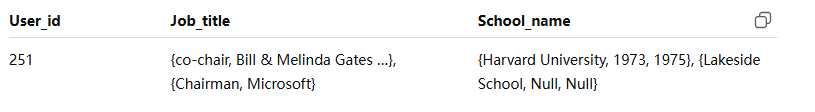

# ✅ **Week 1：Data Access – 全知识点总结（逐点详细解释）**

---

# **1. Data Lakes 与 Data Pipelines（数据湖 & 数据管道）**

📍页 2
### ⭐ 你需要理解的核心概念：

- **Data Lake**：存所有类型的原始数据（Raw format），来自网站、数据库、社交媒体等。
    
- **Data Pipeline**：把数据从来源 → 清洗 → 转换 → 变成可查询的数据（data transforms）。
    
- **目的**：最终让使用者（包括人、应用程序、API）能直接查询干净、结构化的数据。
    

---

# **2. What is Data Services?（数据服务是什么？）**

📍页 3

Data Services 的核心是“两件事”：

### **① Data Integration / Aggregation（数据整合）**

- 从多个来源抓数据（API、文件、数据库、爬虫等）
    
- 清洗、统一格式、组合到一起（data prep）
    

### **② Data Publication（数据发布）**

- 通过 API（REST / SOAP）把处理好的数据给用户使用
    

---

# **3. Implementation Challenges（实现难点）**

📍页 4

### ❗ 最大困难：无法获得 “Single View of X”

例如，“我想知道一个用户的所有信息”，但这些信息可能散落在：

- CSV
    
- 数据库表
    
- 第三方 API
    
- 文档
    
- Excel
    
- 社交媒体
    

### ⚠ 数据不统一的痛点：

- 格式不同（JSON / XML / CSV / PDF…）
    
- 协议不同（HTTP、SOAP、数据库协议…）
    
- 需要手动写复杂的数据整合逻辑（distributed query plan）
    

---

# ==**4. Obtaining Data（如何获取数据）**==

📍页 5–12

Week 1 的核心任务：**理解不同数据来源的收集难度**。

### **（1）Unformatted Text（非结构化纯文本）**

📍页 6–8  
最难处理，因为：

- 内容表达不统一
    
- 需要 NLP、机器学习
    
- 实体识别困难（如 "end point solution" 是公司？产品？）
    

### **（2）PDF**

📍页 9–12  
难点：

- 没有真正的结构
    
- 文字块不代表单词
    
- 表格边界很难识别  
    → 需要工具：PDFMiner、pdftables
    

### **（3）HTML**

📍页 13–20  
常见于爬虫（BeautifulSoup）  
HTML 有标签，所以结构比 PDF 好处理，但仍“半结构化”。
可以利用 **文本内容与页面结构** 来探索文档。
### **（4）XML & JSON**

📍页 21–24  
优点：**结构化数据，简单易解析**  

==XML：==
- 用标签（tag）描述数据
    
- 表示层级结构（树结构）
    
- 用于不同系统之间传输数据

大量有价值的数据以 **JSON 格式** 提供

- 通常来自 Web 服务 API
    

Python 提供了 ==**json**== 库来处理 JSON 数据

- `dump()`：将 Python 对象序列化为 JSON 数据
    
- `load()`：将 JSON 数据解析为 Python 对象

    

### **（5）CSV**

📍页 25–26  
最常见的结构化文件  
大多数 CSV 数据在本质上等同于一张 **（关系型）表格**

- 但可能没有完全符合关系数据库意义上的“规范化”
- 许多 CSV 数据来自电子表格

- 列名（column headings）如果存在，可以提供元数据（metadata）

Python 提供了多个用于处理 CSV 的模块。

**csv 模块**：提供最基础的 CSV 读写功能

- 每一行会变成一个 Python 列表
    
- 所有行组成一个“列表的列表”（list of lists）
    

**pandas 模块**：提供更高级的 CSV 读写能力

- 自动将数据加载为 **DataFrame**（数据表格的抽象形式）
    
- 同时提供大量用于过滤、计算、聚合等操作的方法

---

# **5. E-commerce / Social Media / Search 的数据挑战（真实世界的不同数据需求）**

📍页 29–33

### **① E-Commerce（事务型系统）**

## **E-Commerce website（电商网站）**

- 数据操作主要是事务（Transactions），包含大量 **读取（Reads）与写入（Writes）**
    
- 业务操作几乎全部是在线进行（on-line）
    
- 响应时间需要很快  
    但更重要的是 **确保交易的安全性（security）与可靠性（reliability）**
    
- **ACID 属性非常关键**
    

ACID 四要素意味着：

- **A – Atomicity 原子性：**事务要么全部成功，要么全部失败
    
- **C – Consistency 一致性：**只能写入有效数据
    
- **I – Isolation 隔离性：**事务之间互不干扰
    
- **D – Durability 持久性：**写入的数据不会丢失
    

电商网站因为涉及支付、订单、库存，所以 ACID 很重要。
    

### **② Image/Fan-out 平台（如 Instagram/Twitter）**

## **Image serving website（图片服务网站，例如社交媒体）**

- 数据操作主要是 **读取（Reads）**，用于加载用户照片、视频等
    
- 存在 **“fan-out” 效应**（例如某人发帖后推送给所有粉丝），这是一个技术挑战
    
- 所有操作主要是在线（on-line）进行
    
- 对带宽（bandwidth）的需求很高
    
- ACID 的要求可以相对放宽（Relaxed）
    
    - 例如点赞数稍微延迟同步没关系
        
    - 评论数短暂不一致也不是大问题
        

社交媒体强调 **高吞吐、高并发、快速读取**，不需要强一致性。

==**总结：读特别快（timeline 一次查就能返回）**==
==**写会爆炸（Fan-out Amplification）**==

### **③ Search（搜索引擎）**

## **Search Website（搜索引擎网站，例如 Google）**

- 数据操作主要是 **读取索引文件（Reads）**，用于回答用户查询
    
- 由于原始数据规模巨大（整个 Web），**索引构建（index compilation）在线下（off-line）完成**
    
- ACID 的要求可以放宽（Relaxed）
    
    - 搜索引擎不需要事务一致性
        
- **响应时间必须尽可能快**（用户不会等待）
    

搜索系统的核心是：  
👉 _提前做好索引，加速“读”（查询）_  
而不是实时处理整个互联网。
    

---

# **6. Data Models（数据模型）——Week 1 最大重点章节**

==**应用逻辑使用“应用模型”；而数据库/文件使用“通用数据模型”。**==  
==**两者之间需要转换，这就是 Data Access Layer 的作用。**==

📍页 34–59

### ⭐ 6.1 Relational Model（关系模型 / SQL）

- 最经典模型（几十年验证）
    
- 强调一致性、事务、结构化表格
    
- 多用于商业系统
    

### ⭐ 6.2 NoSQL（分布式、“非关系型”的数据库）

### **为什么需要 NoSQL？**

- **为了实现更大的可扩展性（scalability）**  
    → 支持超大规模数据集或超高写入吞吐量
    
- **为了更灵活、更动态的数据模型**
    
- **不需要固定的表结构（schema-free）**  
    也不需要 JOIN 的概念
    
- **所有 NoSQL 系统都会放松 ACID 的某些属性**  
    → 例如牺牲强一致性，换取性能和扩展性
    
Problems with Relational Models（关系模型的问题）
1
关系模型通常需要进行 **规范化（normalisation）**
规范化会导致数据被拆成多个表格  
→ 很多数据被“分片”（fragments）  
→ 查询时需要大量 **JOIN**
太多的 JOIN 会影响可扩展性（scalability）
因此，用文档嵌套（nested documents）和去规范化（denormalisation），减少 JOIN → 提升速度。

2
Object–Relational Mismatch
对象模型天生是“嵌套 + 引用”的树结构 / 图结构。  
SQL 表天生是扁平的二维结构。  
两者不一致 → 需要 ORM → 复杂、容易出错。

这就是为什么出现 NoSQL（尤其是文档数据库）：  
→ 可以直接保存对象，不需要拆表，不需要 JOIN。

因此：SQL提出了一些扩展功能
有些数据库支持类似 “数组（Array）” 的功能：

可以在同一行中存储多个值
    
这些多值字段可以被查询和建立索引

SQL 的“数组、多值字段”是为了解决 NoSQL 能轻松表达的场景，但：

- 不同数据库对数组支持不一致
    
- 查询语法较复杂
    
- 与关系模型原生理念（单值字段）不一致
    

这是 SQL 向文档数据库（Document Model）“学习”的特殊补丁，并不能完全替代 NoSQL。

故而，
另一种选择：

将信息编码为 JSON（或 XML）文档

将整个文档以 单列文本 存入数据库

访问该数据的应用程序必须自己解析这个文档

数据库本身无法对文档内部的字段进行查询  

文档数据库（如 MongoDB）天然支持这种结构：  
→ 直接存储和查询 JSON 对象。

文档数据库：
- **集合（Collection）没有 schema 限制**  
    → 同一集合中的文档可以具有不同字段  
    → 虽然通常，集合中所有文档属于同一种或相关的业务对象
    
- **没有 JOIN（No joins）**  
    → 因为所有相关数据都嵌入在一个文档里  
    → 存储结构天然支持嵌套

### **Embedded objects（嵌入式对象）**

通常来自“一对多（One-to-Many）”关系。  
例如：

一个用户多段工作
    
一个用户多段教育经历
    

### **Improved “locality”（数据局部性变好）**

- **一次查询就能拿到所有关于 user 的信息**  
    

### **减少 impedance mismatch（减少对象-关系阻抗不匹配）**

文档数据库可以直接将对象保存为 JSON：

这极大减少了应用模型与数据存储模型的差异。

But，
①
文档模型不适合 Many-to-One 或 Many-to-Many，因为会造成大量数据重复，更新困难，也影响查询。
关系型数据库的优势：

用户之间风格一致（统一拼写、统一格式）
    
避免歧义（例如多个城市同名的情况）
    
更新更容易（名称只存一处）
    
搜索更强（例如搜索华盛顿州的慈善家 → 只需 JOIN 匹配 region）
    

并且：

**关系数据库通过“不重复存储文本”，保证一致性 → 这就是规范化（normalisation）存在的原因。**

② 文档会不断变大、互相引用（Document interconnections）
数据重复
更新困难
文档变得臃肿

# **7. Relational vs Document（关系模型 vs 文档模型）**

📍页 39–52

关系数据库擅长处理复杂关系（M-1、M-M），JOIN 高效、成熟。  
文档数据库的 JOIN 很弱，需要应用层自己处理 → 代码变复杂。

 **文档模型适合树形结构（嵌套对象）**  
 **关系模型适合多表、多关系、JOIN 密集的场景**  
**图模型适合复杂关系网络（如社交网络、推荐系统）**

    

### **Schema flexibility（模式灵活性）

很多文档型数据库（如 MongoDB）是 **无模式 schema-less** 的。  
这意味着：

### **1️⃣ 文档型数据库不强制任何 schema（结构）**

- 文档里可以随意新增字段、删除字段，结构不统一
    
- 读数据时，应用程序不知道文档里到底会有什么字段  
    → **风险：数据不一致、字段缺失、字段类型不统一**
    

---

## **Schema-on-read（读时模式）**

- 数据的结构不是提前规定的，而是 **在读取时由应用程序解释**
    
- 属于 **动态 / 运行时（runtime）类型检查**
    
- 灵活但难保证数据质量：你读的时候才知道这个字段到底长什么样
    

**文档数据库（MongoDB）= Schema-on-read**

---

## **Schema-on-write（写时模式）**

- 数据写入数据库之前，必须符合明确的结构（schema）
    
- 类似数据库会严格检查：字段是否存在、类型是否匹配
    
- 属于 **静态 / 编译时（compile-time）类型检查**
    

**关系型数据库（MySQL、PostgreSQL）= Schema-on-write**

✔ 好处：数据一致性强  
✘ 缺点：灵活性差，一旦结构要改必须修改整个 schema

---

文档数据库对查询具有“数据局部性优势（data locality）”，因为文档数据库会将一个文档作为一个连续的字符串存储（例如 JSON、XML 或二进制）。
一次 I/O 就能拿到整个对象（文档）

文档数据库虽然读取快，但 **更新很慢**。
更新其中一个小字段意味着：
整个文档重新写入磁盘

文档数据库与关系数据库正在逐渐融合。

---

# **8. Graph Data Model（图数据库）**

📍页 53–60

多对多（M-M）关系，结构非常复杂 → 需要图模型（graph）
    

图由：

- **Vertices / Nodes（顶点/节点）**：表示实体
    
- **Edges / Arcs（边）**：表示关系
    

图模型非常适合“关系比对象更重要”的场景。

图的节点结构不必统一，关系也不必统一。  
图模型可以自然地表示复杂、不规则的数据。
---

# **9. Data Access in Applications（应用中的数据访问层）**

📍页 60–70

当你在应用程序中使用数据库系统（不管是哪种数据模型），代码会通过某种 **数据连接 API** 向数据库发出查询语句。

使用这一套访问 API 的代码部分，就构成了应用中的 **数据访问层（Data Access Layer）**。
### **存储对象时：**

- 我们需要将内存中的对象转换成数据库可以存储的格式（如 JSON、rows、relations）
    
- 读取时还要把数据库的存储格式转换回应用程序的对象格式
    

---

### **这个过程必须保证：**

- 对象的数据保持一致
    
- 对象之间的关系被正确保存和恢复

### ✅ **阻抗不匹配 = OO 与 SQL 模型不一致**

包括：

1. **结构不匹配**：对象图 vs 表结构
    
2. **关系不匹配**：引用 vs 外键
    
3. **粒度不匹配（Granularity Problem）**
    
4. **继承不匹配（OO 有继承，SQL 没有）**
    
5. **导航方向不匹配（OO 可双向引用，SQL 单向外键）**
    

### ✅ Address 映射的三种方法：

1. **粗粒度（字符串）**
    
2. **细粒度（拆字段）**

Impedance Mismatch Problem的三个点

# **Identity Concept Mismatch（身份概念不匹配）**

- 数据库中只有一个身份概念：**主键（primary key）**
    
- 即主键相同 → 被当作同一个对象（记录）
    
- 主键不同 → 被视为不同对象（即使字段完全一样）
    

这就可能导致问题：

- 两个对象在内存中是不同实例，但数据库认为它们是同一个（主键相同）
    
- 或相反：两个对象内容完全一致，但数据库因为主键不同而认为它们是不同对象

# Association Problem（关联关系问题）
关联是**有方向的**：

- User → BillingDetails
    
- BillingDetails → User
    

如果想双向导航对象（双向访问），必须在两个类中分别定义引用。

# Object Graph Navigation

OO 的链式导航很自然，但在 SQL 中非常昂贵（因为 JOIN）

---

# **10. Query Languages（查询语言）**

📍页 66–68

### Declarative（声明式，SQL、Cypher）

- 你只写“要什么”
    
- 数据库决定“怎么做”
    

### Imperative（命令式）

- 你必须写具体步骤（常见于程序语言）
    

### **为什么声明式语言很好？**

- **数据库自己决定执行方式**（优化器自动选择索引/顺序/策略）
    
- **查询语句保持简洁**
    
- **数据库改进不会影响你的代码**
    
    - 例如数据库更新了索引算法，你的 SQL 不用改
        
- **天然支持并行执行（Parallel Execution）**
    
    - 可以把 query 拆成多部分在不同 CPU 核上运行
        
    - 比如 Oracle 或 PostgreSQL 的 Parallel Query

应用程序绝不会直接操作数据库，而是通过 Data Access Layer 间接访问它。

DBAPI = 连接数据库 + 执行 SQL 的最低层 API
    
DBAPI 缺点：各数据库格式不一致、事务不直观、维护困难
    
SQLAlchemy 解决这些问题，在 DBAPI 上提供统一高级接口
写一次代码，可切换不同数据库

- SQLAlchemy 统一了 Python 对各种数据库的 SQL 访问方式。
    
- 它建立在 DBAPI 之上，但比 DBAPI 功能强大得多。
    
- `create_engine()` 是连接数据库的入口。
    
- SQLAlchemy 通过 **Dialect + Engine** 处理不同数据库差异。
    
- 使用者无需关心 PostgreSQL / MySQL 的不同写法。

创建数据库连接是非常昂贵的（网络握手、认证、协议初始化）。  
如果每次执行 SQL 时都重新创建连接，会非常慢。

解决方案：  
👉 **连接池保存一组已创建好的连接，重复使用**

    
-### 2. **连接池的工作方式**

- 第 1 次需要连接 → 从池中拿一个
    
- 使用完 → 放回池中
    
- 下次再需要 → 直接重用（几乎无延迟）
    

这样可以：

- 提升吞吐量
    
- 避免频繁创建连接
    
- 控制并发连接数量上限，避免数据库崩溃

### 3. **“连接池 ≠ 连接共享”**

老师特别指出：

- **连接共享**：多个线程共用同一个连接（危险 ❌）
    
- **连接池**：每次从池子拿到不同的连接（安全 ✔）
---

MongoDB 是文档数据库（Document DB）

### **MongoDB 的核心优势：**

- 数据以 JSON（BSON）格式存储，天然灵活
    
- 支持数组、子文档、嵌套结构，不需要关系数据库那样的表拆分
    
- 不强制固定 schema（NoSQL 特性）
    
- 文档可以一次性返回所有相关数据（避免 join）
    
- Python 中最常用是 PyMongo

---
图数据库的查询语言——Cypher（Neo4j 使用）

# **11. ORM：Object Relational Mapping**

📍页 80–83

**ORM = Object Relational Mapping**  
意思是：**把面向对象程序里的类 → 映射到关系型数据库的表。**

ORM类 ↔ 表 映射
↑
Core连接池、SQL 构建、类型管理
↑
DBAPI
↑
Database

你的 Python 类  
⬇（交给 ORM）⬇  
ORM 生成 SQL  
⬇（通过 Core 管理）⬇  
实际 SQL 被 DBAPI 执行  
⬇  
数据库读写成功

## **核心思想：**

ORM 不只可以映射单表，它也能把复杂查询的结果映射成对象。
    
也就是：

> **你用对象思维写代码，ORM 帮你执行 SQL。**
> 举例如下： 写 Python 对象即可自动对数据库操作，例如：
    

`u = User(name="Tom", fullname="Tom Hanks") session.add(u) session.commit()`

👉 不需要写 SQL！

---

# **12. Metadata（元数据）**

📍页 84–90

### 什么是 Metadata？
元数据 = 描述数据的数据。

例如照片 metadata 包括：

- 拍摄时间
    
- 分辨率
    
- 拍摄地点
    
- 扫描方式
元数据比你想象的更“暴露”隐私。
没有元数据，数据就无法被更大系统理解或复用。

### Metadata 的类型：

- **Descriptive**（描述性）描述资源内容的元数据
    
	- Dublin Core 是最简洁、最通用的元数据标准（由 15 个核心字段组成）。
    
- **Administrative**（管理性）
    
- **Structural**（结构性）
    
- **Provenance**（来源与过程）

- RDF 是用于描述资源的元数据语言。
    
- RDF 使用 “三元组（Subject–Predicate–Object）” 模型。
    
- 三元组形成关系图，可以进行网络分析和知识图谱构建。
    
- 示例：Mona Lisa — Creator → Da Vinci。

# 第二节：
# Introduction to data services

