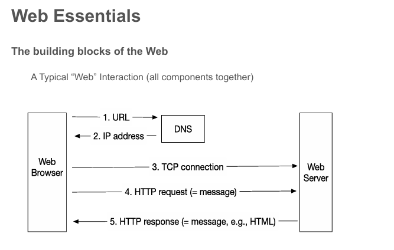
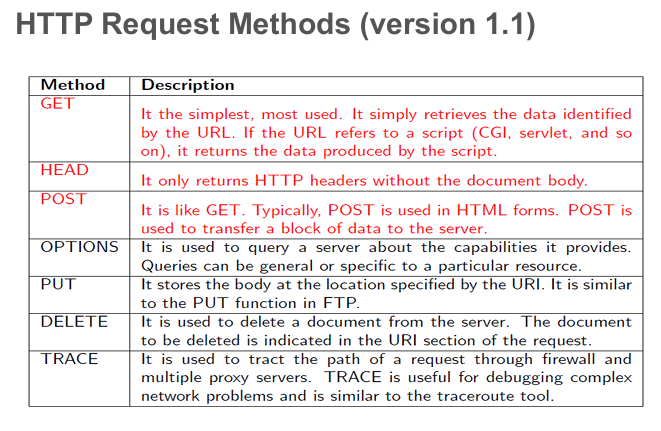
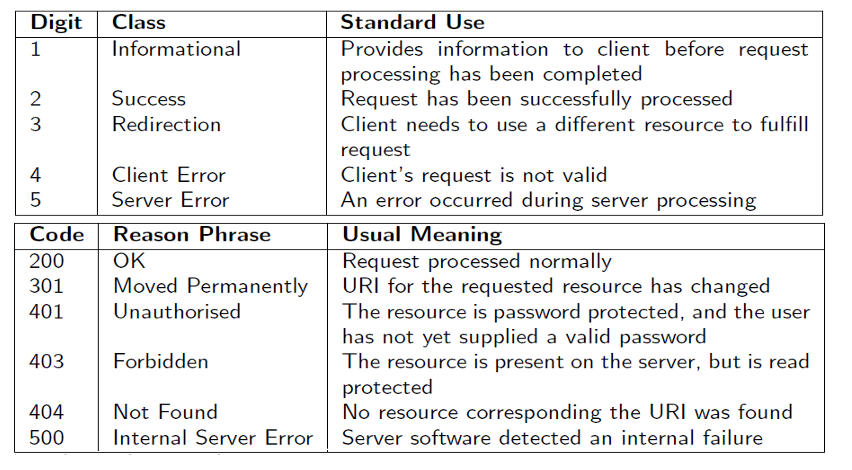

# 数据服务


**模块化与接口化**：每个团队作为“服务”提供方，必须通过接口暴露其功能与数据；内部不能随意绕过接口。

“Web三个基本组成要素：

⭐ URL：统一资源定位符，负责“资源地址”。  
⭐ HTTP：用于在客户端／服务器之间传递请求与响应消息。  
⭐ HTML：用于格式化网页结构与内容。




**HTTP 请求（从浏览器至服务器）：**  
它由 **请求行（Request Line） + 报头（Header） + （可选）附加数据（additional data）** 构成。
请求行示例：
GET http://www.smh.com.au/index.html HTTP/1.1
在报头与附加数据部分之间必须有一个新行（CRLF）。

常见的请求方法（Request methods）：GET、POST、HEAD…

请求报头（Request header）可能包括：User-Agent、Referer、Authorization 等。

附加数据（body）：一般用于 POST 参数、数据块。





**HTTP Response（从服务器到浏览器）：**

- 由 **状态行（Status Line） + 报头（Header） + 主体（Body）** 构成。
    
- 状态行示例：`200 OK`、`404 Not Found` 等。
    
- 报头（Header）包括：`Content-Type`、`Content-Language`、`Content-Length`、`Cache-Control` 等。
    
- 主体（Body）：
    
    - 包含请求的资源数据。
        
    - 主体按特定 MIME 格式（例如 `text/HTML`）呈现。
        
    - MIME（Multipurpose Internet Mail Extension）：可以是纯文本、HTML、多媒体数据、应用程序格式例如 PDF、PowerPoint 等。





⭐ **早期网页架构**：2000 年代初很多站点结构简单、主要面向人类用户浏览器与 HTML 页面交互，整合方式多为“模拟浏览器点击／请求其它网站数据”。


服务化／API 化——站点开始暴露更明确的数据接口（如 XML、JSON 或专门的 API 域名），而不是仅通过网页 UI 获取信息。


一个 WebService 是一种“Consumer_Machine（消费者机器）→ Provider_Machine（提供者机器）”通过计算机网络协作的 schema（模式 / 架构）。


**Why Web Services（为什么要使用 Web Services）**

- 有很多情形下，需要处理的数据非常庞大，或频繁变化，不应该 (cannot / should not) 被硬编码 (hardcoded) 到应用 中。相反，这类数据应当从可靠的外部来源请求 (request) —— 例如，现在欧元兑美元的汇率是多少？
    
- 还有一类应用可能需要非常高的计算能力，这在移动设备上可能不可用。想象的问题例如：在两个地图坐标之间寻找最短 / 最快路线、为旅客选择最佳机票和路线。


**非人工交互界面**

- API不是为人类用户设计的界面，而是程序之间的通信接口
- 需要明确的合约规范（如IOU Alice Bob 100这样的例子）

**内部与外部使用**

- 现代公司既在内部使用API（私有API）
- 也对外提供API服务（公共API）


| 方面       | SOAP                    | REST                 |
| -------- | ----------------------- | -------------------- |
| **复杂度**  | 复杂，需要XML信封              | 简单，使用URL             |
| **格式**   | 严格的XML                  | 灵活（文本/HTML/XML/JSON） |
| **传输协议** | 多种（HTTP/HTTPS/FTP/SMTP） | 主要是HTTP/HTTPS        |
| **服务发现** | 有WSDL工具                 | 缺乏标准探索工具             |
| **开销**   | 较大（创建和解析XML）            | 较小                   |
| **灵活性**  | 低（格式固定）                 | 高（格式自由）              |
- **REST是架构风格**，不是协议
- **以资源为中心**的设计思想
- **使用标准HTTP方法**（GET、POST、PUT、DELETE等）
- **无状态通信**，每个请求独立
- **JSON格式**已成为REST API的事实标准
- **URI作为资源定位**的唯一标识


## 资源是 REST 的核心

**关键概念**：在 REST 中，一切始于资源，资源是基本单位。

## 什么是资源？

**定义**：任何可以被命名的信息都可以是资源，包括：

- 文档或图像
- 临时服务（如洛杉矶今日天气）
- 其他资源的集合
- 非虚拟对象（如人）
- 任何可能成为作者超文本引用目标的概念

## 资源的具体特征

一个资源必须满足：

- **唯一性** - 可被唯一标识
- **至少一种表现形式** - 可以用某种方式呈现
- **有属性** - 除了ID之外还有其他属性
- **有定义/模式** - 具有潜在的结构定义
- **有状态** - 可提供上下文（状态可以改变/更新）
- **可寻址** - 在可寻址的范围内可访问
- **有关系** - 可以是集合或关系


## 表现层状态转移（Representational State Transfer）

**核心概念**：REST 是一个 Web 资源网络（虚拟状态机），用户通过以下方式在应用中进行导航：

- **选择链接**：如 /students/M. Scott
- **执行操作**：如 GET 或 DELETE（状态转换）
- **结果**：进入下一个资源，代表应用的下一个状态
- **状态转移**：新状态被传递给用户使用

**示例流程**： 查询 M. Scott → 显示学生列表 → 选择 M. Scott → 显示详细信息 → Done 或 Cancel

---

## 资源的多重表现形式

**关键原则**：REST 不指定"标准数据格式"，而是**基于消费者的需求**提供不同格式。

**同一资源（M.Scott state）可以有多种表现形式**：

通过"业务逻辑"读取后，根据不同需求输出：

- **HTML** - 用于浏览器
- **XML** - 用于其他应用
- **JSON** - 用于移动应用
- **Image** - 图像格式
- **PDF** - PDF 文档
- **TEXT** - 纯文本


RESTful 服务/API 必须通过遵循设计指南/原则来满足架构约束。

## REST 的六大架构约束

1. **Client-Server（客户端-服务器）**
    - 客户端和服务器分离
2. **Uniform Interface（统一接口）**
    - 标准化的交互方式
3. **Statelessness（无状态性）**
    - 每个请求独立，服务器不保存客户端状态
4. **Caching（缓存）**
    - 响应可以被缓存以提高性能
5. **Layered System（分层系统）**
    - 可以有中间层（如代理、网关）
6. **Code on demand（按需代码）** - 可选
    - 服务器可以发送可执行代码给客户端


## 统一接口 - 资源 URI

### 核心原则

**资源通过 URI 标识（Uniform Resource Identifier）** **一个资源至少要有一个 URI**

### 常见的 URI 类型

#### 1. URN（Uniform Resource Name - 统一资源名称）

**名称标识，与位置无关**

示例：

- `urn:isbn:0-486-27557-4`（莎士比亚的《罗密欧与朱丽叶》书籍）
- `urn:isan:0000-0000-9E59-0000-O-0000-0000-2`（2002年蜘蛛侠电影）

#### 2. URL（Uniform Resource Locator - 统一资源定位符）

**位置标识，指向资源所在位置**

示例：

- `file:///home/tommy/plays/RomeoAndJuliet.pdf`
- `http://home/tommy/plays/RomeoAndJuliet.html`

### 重要原则

**每个 URI 精确指定一个资源**


---

## 统一接口 - 可寻址性（Addressability）

### 核心要求

**资源必须是可寻址的**

### 什么是"可寻址"？

**定义**：应用程序将其数据集作为资源公开（通常是大量的 URI）

### 可寻址系统的例子

✅ **计算机文件系统**

- 每个文件都有唯一路径
- 可以通过路径访问

✅ **电子表格中的单元格**

- 通过单元格引用寻址（如 A1, B2）

✅ **Flickr（图片分享网站）**

- "可寻址"Web 的好例子
- 可以收藏、在程序中作为链接使用、通过邮件发送等

### 不可寻址的系统

❌ **某些数据库查询结果**

- 没有固定的 URI

❌ **临时生成的内容**

- 无法被持久引用


# 统一接口 - 表现形式（Representations）- 笔记

## 核心概念

### 资源需要表现形式才能发送给客户端

**表现形式 = 资源"当前状态"的某些数据**

---

## 一、什么是表现形式？

### 定义

资源的表现形式是关于资源当前状态的数据

### 示例：软件项目的开放 bug 列表

同一个资源可以有多种表现形式：

- **XML 文件**
- **网页**（HTML）
- **逗号分隔值**（CSV）
- **打印友好格式**等


---

## 二、表现形式的双向流动

### 不仅仅是服务器到客户端

**反向流动也可以**：

- 客户端发送资源的新的或更新的"表现形式"
- 服务器创建/更新资源

**例如**：

```
客户端 → 发送新书信息（JSON/XML）→ 服务器
服务器 → 创建新的书籍资源
```

---

## 三、提供多种表现形式

### 应该提供多个表现形式

**在多个表现形式之间做选择**

### 选项 1：为每个表现形式提供不同的 URI

**示例：同一文档的不同语言版本**

```
http://www.example.com/release_doc/104.en  (英语)
http://www.example.com/release_doc/104.es  (西班牙语)
http://www.example.com/release_doc/104.fr  (法语)
```

### 评价

✅ **优点**：看起来非常"可寻址" → 好！

**含义**：

- 每个版本都有独立的 URI
- 可以直接收藏、分享特定语言版本
- 符合 REST 的可寻址性原则


### 选项 2：内容协商（Content Negotiation）

**使用 HTTP HEAD（元数据）进行内容协商**

#### 实现方式

**暴露单一 URI**：

```
http://www.example.com/release_doc/104
```

**客户端 HTTP 请求包含 Accept-Language**：

```
GET /release_doc/104 HTTP/1.1
Host: www.example.com
Accept-Language: es  (西班牙语)
```

#### 内容协商（HTTP 规范的一部分）

**其他类型的请求元数据可以设置以指示各种客户端偏好**：

- 文件格式（file format）
- 支付信息（payment information）
- 认证凭证（authentication credentials）
- 客户端 IP 地址（IP address of the client）
- 缓存指令（caching directives）
- 等等

#### 结论

**选项 1 或选项 2 都是可接受的基于 REST 的解决方案**

---

## 二、统一接口 - 描述语法（Description Syntax）

### 核心原则

**使用纯 HTTP 方法作为资源的主要操作**

### HTTP 规范对以下方法的说明

#### 主要 HTTP 方法

**GET**：检索资源的表现形式

- 只读操作
- 不改变服务器状态

**PUT**：创建新资源（新 URI）或更新资源（现有 URI）

- 创建：如果 URI 不存在，创建新资源
- 更新：如果 URI 已存在，替换现有资源

**DELETE**：清除资源，之后 URI 不再有效

- 删除后该 URI 应返回 404

**POST***：修改资源的状态

- POST 是读写操作，可能改变资源状态并在服务器上引发副作用
- Web 浏览器在刷新 POST 生成的页面时会发出警告
- 关于其确切的最佳实践用法存在争议

**HEAD, OPTIONS 和 PATCH**

- 辅助方法

---

## 三、与 CRUD 的对应关系

### 类似于 CRUD（创建、读取、更新、删除）数据库操作

|HTTP 方法|CRUD 操作|说明|
|---|---|---|
|**POST**|Create|创建（有争议）|
|**GET**|Read|读取|
|**PUT**|Update|更新/创建|
|**DELETE**|Delete|删除|

**注意**：POST 的确切最佳实践用法存在争议


REST 要求使用统一接口！


### 1. POST vs PUT 的区别 
**POST /orders**： - "创建一个新订单，服务器决定 ID" - 非幂等：多次调用创建多个资源 
**PUT /orders/order?id=1234**： - "把这个具体的订单设置为这个状态" - 幂等：多次调用结果相同 
### 2. 统一接口的优势 
✅ **可预测性**：开发者知道每个方法的作用 
✅ **标准化**：所有 REST API 遵循相同规则 
✅ **互操作性**：客户端可以通用处理 
✅ **缓存友好**：GET 可以被缓存