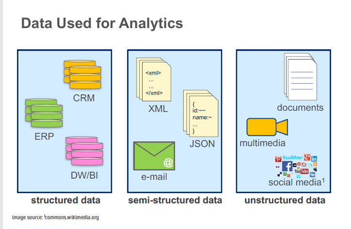
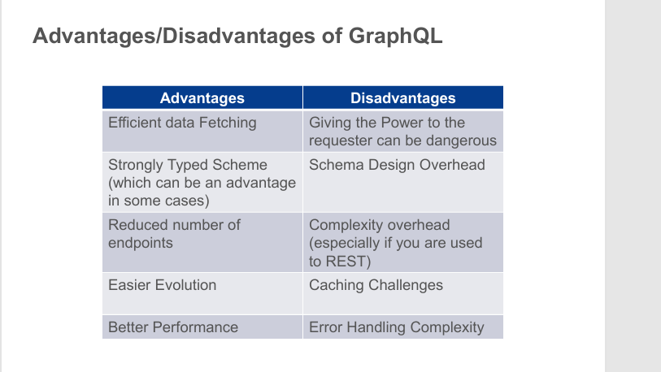

# Introduction to Data Analytics
## 第二页：分析类型

介绍了四种主要的分析类型：

- **描述性分析**：告诉我们过去发生了什么，帮助理解业务表现
- **诊断性分析**：深入分析数据，了解为什么会发生某些事情
- **预测性分析**：预测未来最可能发生什么，提供可操作的洞察
- **规范性分析**：提供行动建议，利用预测结果指导具体解决方案
这是一个从"回顾过去"到"指导未来"的递进分析框架。


## 第一页：众包数据分析

展示了一个**众包分析流程**：

- **分析师**负责：选择图表 → 查看结果
- **众包人群**负责：生成解释 → 评价解释
- 形成一个循环协作的分析微任务和评价微任务系统

## 第二页：什么是机器学习？

两个核心定义：

- 机器学习是**人工智能的应用**，使系统能够**自动学习**并从经验中改进，无需显式编程
- 专注于开发**能够访问数据并自我学习的计算机程序**

## 第三页：常用术语

解释了机器学习中的基本概念：

- **特征(Features)**：描述项目的独特特征
- **样本(Samples)**：待处理的项目（如文档、记录、CSV行等）
- **特征向量(Feature vector)**：用于描述项目的n维向量
描述一个水果:颜色、大小、重量、甜度 → [255, 8, 150, 7]
- **特征提取(Feature Extraction)**：准备特征向量，理想情况是将高维数据转换到低维空间
- **训练集(Training set)**：用于发现预测关系的数据样本集


## 第一页：常用基本统计量

- ==**均值(Mean)**：数据集的平均值==
- ==**中位数(Median)**：有序数据集的中间值==
- ==**众数(Mode)**：数据集中出现最频繁的值，如有多个则为多峰分布==
- **概率(Probability)**：随机实验中事件发生的可能性度量
- **贝叶斯定理(Bayes' Theorem)**：基于相关条件的先验知识描述事件概率
- ==**极差(Range)**：数据集中最高值与最低值之间的差==

## 第二页：常用基本统计量（续）

- ==**方差(Variance)**：数值与均值的平均平方差，衡量数据相对于均值的分散程度==
- ==**标准差(Standard Deviation)**：各数据点与均值的标准差异，是方差的平方根==
- **因果关系(Causality)**：两个事件之间的关系，其中一个事件受另一个事件影响
- **协方差(Covariance)**：两个或多个变量之间联合变异性的定量度量
- ==**相关性(Correlation)**：度量两个变量之间的关系，范围从-1到1，是协方差的标准化版本==

机器学习的六个步骤：

1. **准备(Prepare)**数据
2. **定义(Define)**和**初始化(Initialize)**模型
3. **训练(Train)**模型（使用训练数据集）
4. **验证(Validate)**模型（使用测试数据集进行预测）
5. **使用**：**探索(Explore)**或**部署(Deploy)**为网络服务
6. **更新(Update)**和**重新验证(Revalidate)**


展示了机器学习的两个阶段：

**(a) 训练阶段**： 输入 → 特征提取器 → 特征 → 机器学习算法 ← 标签

**(b) 预测阶段**： 输入 → 特征提取器 → 特征 → 分类器模型 → 标签


分类任务classification：是或否
回归任务regression：多少
聚类任务：clustering：相关视频推荐
强化学习：车辆应该往右还是往左


## 第一页：线性回归工作原理

**核心公式：** Ŷ = f(X) + ε

**各部分含义：**

- **X (输入)** = 作业成绩 (Assignment Results)
- **Y (输出)** = 期末考试成绩 (Final Exam Mark)
- **f** = 描述X和Y之间关系的函数
- **ε (误差项)** = 随机误差项（可正可负），均值为零。这里假设残差项符合某些统计假设，但暂不深入讨论

简单来说，线性回归试图找到一个函数关系，通过学生的作业成绩来预测其期末考试成绩。
**总结：** 线性回归是一种监督学习方法，通过历史数据找到输入变量和输出变量之间的线性关系，从而对新数据进行预测。


分类任务：
需要数据标注
训练就是map 输入数据 到 分类


聚类就是无监督
**聚类的核心特点：**

- **无监督学习(Unsupervised Learning)** - 不需要预先标注的数据，算法自动发现数据中的模式
- **自动分组** - 将对象自动分组到所谓的"簇(clusters)"中
- **组内相似** - 同一组内的对象彼此相似
- **组间差异** - 不同组之间的对象差异较大


# 第二节：GraphQL

## 第一页：什么是GraphQL

**核心定义：**

GraphQL是一种**API查询语言(query language for APIs)**，同时也是一个运行时环境，用于使用现有数据完成这些查询。

**主要特点：**

1. **完整且易懂的数据描述**
    - 为API中的数据提供完整且可理解的描述
2. **精确查询（核心优势）**
    - 赋予客户端**准确请求所需数据的能力，不多也不少**
    - 这是GraphQL最重要的特性之一
3. **易于演进**
    - 使API随时间推移更容易演进和升级
4. **强大的开发工具**
    - 支持功能强大的开发者工具

**与传统REST API的区别：**

- **REST API**: 通常返回固定结构的数据，可能包含很多不需要的字段（过度获取）或需要多次请求（获取不足）
- **GraphQL**: 客户端精确指定需要哪些字段，一次请求获取所有需要的数据，不多不少


## 为什么GraphQL很重要？

**实际应用场景示例：**

假设你在开发一个用户界面，只需要显示用户的名字和邮箱：

**传统REST API：**

```
GET /api/user/123
返回：{
  id, name, email, address, phone, 
  birthday, preferences, history, ...
}
// 返回了很多不需要的数据
```

**GraphQL：**

```
query {
  user(id: 123) {
    name
    email
  }
}
// 只返回需要的name和email
```

**优势：**

- 减少网络传输数据量
- 提高应用性能
- 前端开发更灵活
- 减少API版本管理的复杂性

**目前使用GraphQL的知名公司：** GitHub, Shopify, Twitter, Airbnb, Netflix等


这个PPT详细对比了**REST API与GraphQL**的区别。让我为您详细解释：

## 第一页：REST API vs GraphQL 对比表

|对比维度|REST|GraphQL|
|---|---|---|
|**定义**|一套定义客户端与服务器之间结构化数据交换的规则|一种查询语言、架构风格和工具集，用于创建和操作API|
|**最适用场景**|适合简单、资源定义明确的数据源|适合大型、复杂和相互关联的数据源|
|**数据访问**|使用多个端点（URLs）来定义资源|使用单一URL端点|
|**返回的数据**|以固定结构返回数据（由服务器定义）|以灵活结构返回数据（由客户端定义）|
|**数据结构定义**|采用弱类型，客户端必须决定如何解释返回的格式化数据|采用强类型，客户端以预定义和相互理解的格式接收数据|
|**错误检查**|客户端必须检查返回的数据是否有效|数据在返回前会根据schema结构自动验证，生成自动生成的错误消息|

## 第二页：GraphQL API调用示例

这个图展示了GraphQL的实际工作流程：

**HTTP请求（左侧）：**

```
POST /graphql

query {
  user(id: 1) {
    id
  }
}
```

**关键特点：**

- 使用单一端点 `/graphql`
- 通过POST方法发送
- 查询语句明确指定需要的字段（这里只要id）

**HTTP响应（右侧）：**

json

```json
{
  "user": {
    "id": 1,
  }
}
```

**流程说明：**
1. App（应用）发送HTTP请求到API
2. API处理查询
3. API返回精确匹配请求的数据结构

## 核心区别总结

**REST API的特点：**
- 多个端点：`/users`, `/users/1`, `/users/1/posts`
- 固定的数据结构
- 可能过度获取或获取不足
- 需要多次请求获取关联数据

**GraphQL的优势：**
- 单一端点：`/graphql`
- 灵活的查询
- 精确获取所需数据
- 一次请求获取关联数据
- 强类型系统，自动验证

**实际例子：**

假设你需要获取用户信息和他的文章：

**REST方式：**
```
GET /users/1          → 返回用户全部信息
GET /users/1/posts    → 返回用户所有文章
// 需要2次请求，可能返回很多不需要的字段
```

**GraphQL方式：**
```
query {
  user(id: 1) {
    name
    posts {
      title
    }
  }
}
// 一次请求，只返回name和post titles
````

**总结：** GraphQL提供了更灵活、高效的数据获取方式，特别适合复杂的现代应用程序，但REST API因其简单性在简单场景下仍然很有价值。


## 第一页：GraphQL字段和参数

**核心概念：**

1. **响应结构模仿查询结构**
    - GraphQL的响应数据结构与查询请求的字段结构完全一致
2. **字段可能来自单个或多个资源**
    - 一次查询可以从不同的数据源获取数据并组合返回


## 第二页：GraphQL的三种操作类型

**GraphQL支持三种操作类型：**

### 1. **Query（查询）** - 读取操作

- 用于获取数据
- 类似于REST API的GET请求

### 2. **Mutation（变更）** - 创建或更新操作

- 用于修改服务器数据
- 类似于REST API的POST/PUT/DELETE请求

### 3. **Subscription（订阅）** - 更新通知

- 用于实时接收数据更新通知
- 类似于WebSocket实时推送


## ==GraphQL的优劣==



## GraphQL的优势 (Advantages)

### 1. **高效的数据获取 (Efficient Data Fetching)**

- 客户端可以精确指定需要的数据
- 避免过度获取（over-fetching）和获取不足（under-fetching）
- 一次请求获取所有需要的数据

**例子：** 只需要用户的姓名和邮箱时，不会返回整个用户对象的所有字段

### 2. **强类型Schema (Strongly Typed Scheme)**

- 提供清晰的数据结构定义
- 在某些情况下可以作为优势
- 自动验证和类型检查
- 更好的开发工具支持（自动补全、文档生成）

### 3. **减少端点数量 (Reduced Number of Endpoints)**

- 只需要一个端点 `/graphql`
- 简化API结构
- 更容易维护

**对比REST：** REST可能需要 `/users`, `/users/:id`, `/users/:id/posts` 等多个端点

### 4. **更容易演进 (Easier Evolution)**

- 可以添加新字段而不影响现有查询
- 废弃字段时可以标记但保留
- 版本管理更简单
- 向后兼容性更好

### 5. **更好的性能 (Better Performance)**

- 减少网络请求次数
- 只传输需要的数据
- 减少带宽使用

---

## GraphQL的劣势 (Disadvantages)

### 1. **赋予请求者权力可能很危险 (Giving Power to the Requester Can Be Dangerous)**

- 客户端可以构造复杂的嵌套查询
- 可能导致服务器过载
- 需要实施查询复杂度限制
- 潜在的安全风险

**例子：** 恶意查询可能嵌套100层深度，导致服务器崩溃

### 2. **Schema设计开销 (Schema Design Overhead)**

- 需要预先设计完整的类型系统
- 初始设置时间较长
- 需要团队学习GraphQL Schema语言
- 对于简单API可能过度工程化

### 3. **复杂度开销 (Complexity Overhead)**

- **特别是对于习惯REST的团队**
- 学习曲线较陡
- 需要新的思维方式
- 实现比REST更复杂

### 4. **缓存挑战 (Caching Challenges)**

- HTTP缓存机制不能直接使用（因为都是POST请求）
- 需要实现自定义缓存策略
- 比REST的URL缓存更复杂
- 需要使用专门的工具（如Apollo Client）

### 5. **错误处理复杂性 (Error Handling Complexity)**

- GraphQL请求即使部分失败也返回200状态码
- 错误信息在响应体的`errors`字段中
- 需要检查响应体来判断是否有错误
- 不能依赖HTTP状态码进行错误处理