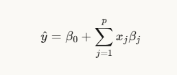
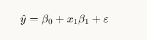
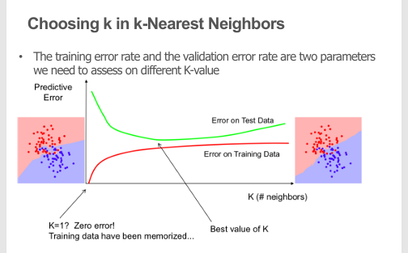

# 第一节：Linear Regression
## 第一页：表示/训练/评估/优化循环 (Represent/Train/Evaluate/Refine Cycle)

这是机器学习项目的**迭代开发循环**，包含四个关键步骤：

### **循环流程：**

```
1. Representation (表示)
   ↓
2. Train models (训练模型)
   ↓
3. Evaluation (评估)
   ↓
4. Feature and model refinement (特征和模型优化)
   ↓
返回到 1. Representation
```

### **各阶段详解：**

**1. Representation (表示/特征提取)**

- 提取和选择对象特征
- 数据预处理
- 特征工程
- 选择合适的数据表示方式

**2. Train models (训练模型)**

- 将估计器（estimator）拟合到数据
- 使用训练数据训练机器学习模型
- 学习数据中的模式

**3. Evaluation (评估)**

- 评估模型性能
- 使用验证集或测试集
- 计算准确率、误差等指标
- 判断模型是否满足要求

**4. Feature and model refinement (特征和模型优化)**

- 根据评估结果调整特征
- 优化模型参数
- 尝试不同的算法
- 改进模型性能

**关键点：**

- 这是一个**迭代循环**，不是一次性过程
- 每次循环都可能改进模型
- 持续优化直到达到满意的性能


## 第一张：线性回归的目标

==**核心概念**：找到"最佳"直线（线性函数 y=f(X)）来解释数据==

- 图中显示了散点数据和一条红色拟合线
- 目标是找到最能代表这些数据点整体趋势的直线

## 第二张：线性回归的数学表达式

**预测公式**：



**含义**：

- y^\hat{y} y^​ = 预测值
- β0\beta_0 β0​ = 截距（intercept）
- xjx_j xj​ = 第j个特征/自变量
- βj\beta_j βj​ = 第j个特征的系数
- pp p = 特征总数

**关键点**：系数向量 β\beta β 就是回归模型

## 第三张：回归公式的详细解析


### 以单变量为例（j=1）：



**各部分含义**：

1. **β0\beta_0 β0​（截距）** ：直线与y轴的交点
2. **x1x_1 x1​（预测变量）** ：输入的特征值
3. **β1\beta_1 β1​（斜率）** ：直线的倾斜程度
4. **ε\varepsilon ε（随机误差）** ：预测值与真实值之间的差异

**重要概念**：

- 斜率和截距被称为**回归系数**或**模型参数**
- **我们的目标是估计这些模型参数**

换句话说，线性回归就是通过数据找到最合适的 β0\beta_0 β0​ 和 β1\beta_1 β1​（或更多的 βj\beta_j βj​），使得模型能最好地预测目标变量 y。


# 线性回归详解

## 第一张幻灯片：使用线性回归的假设条件

### 必须满足的假设

1. **结果变量必须是连续的**
    - 不能是分类变量（如"是/否"）
2. **特征与目标之间存在线性关系**
    - 数据点应该大致呈直线趋势
3. **特征之间几乎没有或完全没有多重共线性**
    - 自变量之间不应高度相关
4. **误差项呈正态分布**
    - 残差应该符合正态分布
5. **异常值最少**
    - 极端值会严重影响回归结果

### 如何检验这些假设？

- **绘图**
    - 散点图
    - 直方图
- **计算系数**
    - 相关系数等统计量

---

## 第二张幻灯片：相关系数

### 相关系数公式

r=n(Σxy)−(Σx)(Σy)[nΣx2−(Σx)2][nΣy2−(Σy)2]r = \frac{n(\Sigma xy) - (\Sigma x)(\Sigma y)}{\sqrt{[n\Sigma x^2 - (\Sigma x)^2][n\Sigma y^2 - (\Sigma y)^2]}}r=[nΣx2−(Σx)2][nΣy2−(Σy)2]​n(Σxy)−(Σx)(Σy)​

### 相关系数 r 的解释

|r 值|含义|
|---|---|
|**r = 1**|强正相关 - 完美的正线性关系|
|**r = -1**|强负相关 - 完美的负线性关系|
|**r = 0**|无相关关系 - 两变量间没有线性关系|

**取值范围**：-1 ≤ r ≤ 1

---

## 第三张幻灯片：线性回归公式

### 多变量回归公式

y^=β0+∑j=1pxjβj+ε\hat{y} = \beta_0 + \sum_{j=1}^{p} x_j\beta_j + \varepsilony^​=β0​+j=1∑p​xj​βj​+ε

### 单变量示例（j=1）

y^=β0+x1β1+ε\hat{y} = \beta_0 + x_1\beta_1 + \varepsilony^​=β0​+x1​β1​+ε

### 公式各部分说明

|符号|名称|含义|
|---|---|---|
|β0\beta_0<br>β0​|**截距**|直线与y轴的交点|
|x1x_1<br>x1​|**预测变量**|输入特征|
|β1\beta_1<br>β1​|**斜率**|直线的倾斜程度|
|ε\varepsilon<br>ε|**随机误差**|预测值与真实值的差异|

### 核心目标

> **我们的目标是估计模型参数**

斜率和截距被称为：

- 回归系数
- 模型参数


# 线性回归优化方法详解

## 第一张幻灯片：挑战

### 核心问题

**找到 β0 和 β1 的值，使对应的直线成为最佳拟合线或产生最小误差（最小成本）**

### 解决方案

1. **可能的方案**：使用最小二乘误差（Least Square Error）解法
2. **关键问题**：
    - 从哪里开始？
    - 如何确定提议的直线？
    - 答案：**梯度下降**（Gradient Descent）

---

## 第二张幻灯片：最小二乘误差解法


## 第三张幻灯片：什么是梯度下降？

### 概念类比

用登山来比喻梯度下降过程：

### 关键要素

1. **陡峭斜坡（Steep slope）**
    - β 的值较高
    - 采取大步（large steps）
2. **平缓斜坡（where slope is less steep）**
    - β 的值较低
    - 采取小步（small steps）
3. **目标（Goal）**
    - 到达山谷最低点
    - 对应最小误差

### 工作原理

- **起点**：从某个初始位置开始
- **方向**：沿着斜坡最陡的方向下降
- **步长**：根据斜坡陡峭程度调整
    - 斜坡陡 → 步子大 → 快速下降
    - 斜坡缓 → 步子小 → 精细调整
- **终点**：到达最低点（最优解）

### 算法特点

梯度下降是一种**迭代优化算法**：

- 不直接计算最优解
- 通过逐步调整参数逼近最优解
- 适用于无法直接求解的复杂问题


# 梯度下降与线性回归类型详解

## 第一张幻灯片：梯度下降

### 核心概念

**梯度下降是一种更新 β0 和 β1 以减少成本函数（最小二乘误差）的方法**

### 工作原理

1. **初始化**
    - 从 β0 和 β1 的某些初始值开始
2. **迭代更新**
    - 反复改变这些值以降低成本
    - 梯度下降帮助我们确定如何改变这些值
3. **梯度计算**
    - 为了更新 β0 和 β1，我们从成本函数中取梯度
    - 通过对 β0 和 β1 分别求偏导数来找到这些梯度

### 学习率的权衡

|学习率类型|优点|缺点|
|---|---|---|
|**较小的学习率**|能更接近最小值|到达最小值需要更长时间|
|**较大的学习率**|收敛更快|可能会**超过最小值**（overshooting）|

---

## 第二张幻灯片：线性回归类型

### 1. 简单线性回归（Simple Linear Regression）

**公式**：

Y=β0+β1X1+εY = \beta_0 + \beta_1X_1 + \varepsilonY=β0​+β1​X1​+ε

**特点**：

- 只有**一个自变量** X₁
- 在二维平面上表示为一条直线
- 图示：二维散点图上的拟合线

### 2. 多元线性回归（Multiple Linear Regression）

**公式**：

Y=β0+β1X1+β2X2+εY = \beta_0 + \beta_1X_1 + \beta_2X_2 + \varepsilonY=β0​+β1​X1​+β2​X2​+ε

**特点**：

- 有**多个自变量**（X₁, X₂, ...）
- 在三维或更高维空间中表示为一个平面或超平面
- 图示：三维空间中的拟合平面

---

## 第三张幻灯片：多元回归 vs 简单回归

### 简单线性回归

**定义**：

- 比较因变量的响应与**某一个解释变量**变化的关系

**局限性**：

- 因变量很少只由**一个变量**解释

### 多元线性回归

**使用场景**： 当因变量受**多个自变量**影响时使用

**目的**： 尝试使用**多于一个独立变量**来解释因变量

### 关键假设

多元回归基于以下假设：

1. **线性关系**
    - 因变量和自变量之间存在**线性关系**
2. **无多重共线性**
    - 自变量之间**没有主要的相关性**
    - 即自变量之间应该是相互独立的


# 多元线性回归特征选择详解

## 第一张幻灯片：多元线性回归（特征选择）

### 基本定义

**多元线性回归解释了一个连续因变量(y)与两个或多个自变量(β₁, β₂, β₃... 等)之间的关系**

### 核心挑战

**如何确定保留哪些特征，舍弃哪些特征？**

### 四种主要方法

1. **全部纳入法（Chuck Everything In and Hope for the Best）**
    - 把所有变量都放进去，希望获得最好结果
    - ⚠️ 通常不是最优策略
2. **后向消除法（Backward Elimination）**
    - 从所有变量开始，逐步删除不重要的变量
3. **前向选择法（Forward Selection）**
    - 从没有变量开始，逐步添加重要的变量
4. **双向消除法（Bidirectional Elimination）**
    - 结合前向和后向，同时进行添加和删除

---

## 第二张幻灯片：需要了解的知识（P值）

### P值的含义

**P值检验每个项的零假设：系数等于零（无影响）**

### P值的解读

#### 低P值（< 0.05）

- ✅ **可以拒绝零假设**
- **含义**：预测变量有意义
- **结论**：预测变量的值变化与响应变量的变化**相关**
- **行动**：应该将这个预测变量添加到模型中

#### 高P值（≥ 0.05）

- ❌ **不能拒绝零假设**
- **含义**：预测变量的变化与响应变量的变化**不相关**

### 零假设（Null Hypothesis）类比

**药物试验例子**：

```
假设你在测试一种药物的效果：
- 零假设：药物不起作用
- 在试验中，服药组和未服药组之间不会有差异
- 差异为零

你总是假设零假设为真，除非有证据证明它不是真的
```

### 统计学基本原则

> **始终假设零假设为真，直到有证据证明它不是**

---

## 第三张幻灯片：后向消除法

### 步骤详解

#### 步骤1：设定显著性水平

**首先，需要设定数据保留在模型中的显著性水平**

**示例**：

- 可以设定显著性水平为 **5%**（SL = 0.05）
- ⚠️ 这很重要，会产生实际影响，需要认真考虑

#### 步骤2：拟合完整模型

**使用所有可能的预测变量拟合完整模型**

#### 步骤3：找到P值最高的预测变量

**考察P值最高的预测变量**

**判断逻辑**：

```
如果 P值 > 显著性水平(SL)
    → 移到步骤4
否则
    → 完成！模型已准备好
```

#### 步骤4：删除该预测变量

**删除P值最高的预测变量**

然后返回步骤2，用剩余变量重新拟合模型

---

## ==后向消除法流程图==

```
开始
  ↓
[1] 设定显著性水平 (如 SL = 0.05)
  ↓
[2] 拟合包含所有变量的完整模型
  ↓
[3] 找到P值最高的变量
  ↓
判断：P值 > SL ?
  ↓YES          ↓NO
[4] 删除该变量   完成✓
  ↓
返回步骤[2]
```

# 后向消除法与共线性详解

## 第一张幻灯片：后向消除法（续）

### 步骤4：删除P值最高的预测变量

**操作说明**： 删除具有最高P值的预测变量

### 步骤5：重新拟合模型

**重要提醒**：

- 删除变量后，必须**重新拟合和重建模型**
- 系数和常数会发生变化
- 当你删除一个变量时，会影响其他变量

**原因**： 变量之间存在相互影响，删除一个变量会改变其他变量的系数

### 步骤6：迭代直到完成

**操作流程**：

1. 返回步骤3
2. 重新执行整个过程
3. 持续迭代，直到：
    - 所有剩余变量的P值都 **< SL**（显著性水平）
    - 此时模型准备就绪 ✓

**最终结果**：

- 所有保留的变量P值都小于显著性水平
- 模型中只保留统计上显著的变量


---

## 第二张幻灯片：相关性和共线性

### 什么是共线性？

**检查共线性的作用**： 帮助你去除那些通过与另一个变量存在**显著关系**而扭曲数据的变量

### 相关性 vs 共线性

**相关性（Correlation）**：

- 描述两个变量之间的**关系**
- ==如果它们**高度相关**，则它们是**共线的（collinear）**==

### 共线性的影响

**当预测变量之间存在高度共线性（相关系数为1.00）时**：

❌ **负面影响**：

1. 影响系数的准确性
2. 降低LSE（最小二乘误差）的精度
3. 模型的可靠性下降

### 如何检测共线性？

**最简单的方法**：

1. **图形化方法**
    - 绘制散点图

2. **数值方法**
    - 查看相关系数矩阵
    - 检查成对相关性


# 第二节：Week 8: Classification

# 机器学习与监督学习详解

## 第一张幻灯片：数据分析的机器学习流程

### 机器学习模型开发的5个关键步骤

#### 1. **定义（Define）和初始化（Initialize）模型**

- 选择合适的算法类型
- 设置初始参数

#### 2. **训练（Train）模型**

- 使用训练数据集
- 让模型学习数据中的模式

#### 3. **验证（Validate）模型**

- 使用测试数据集进行预测
- 评估模型性能

#### 4. **使用模型**

两种方式：

- **探索（Explore）**：用于数据分析和洞察
- **部署（Deploy）**：作为Web服务部署到生产环境

#### 5. **更新（Update）和重新验证（Revalidate）**

- 随着新数据的到来持续改进模型
- 定期重新评估模型性能

---

## 第二张幻灯片：监督学习

### 定义

**我们被给定一个函数的输入样本(X)和输出样本(y)：y = f(X)**

### 目标

**我们想要"学习"函数f，并在新数据上评估它**

---

### 监督学习的两种类型

#### 1. **分类（Classification）**

- **特征**：y是**离散的**（类别标签）
- **输出**：类别/标签

**示例**：

```
   - 邮件分类：垃圾邮件 vs 正常邮件
   - 图像识别：猫 vs 狗
   - 疾病诊断：健康 vs 患病
```

#### 2. **回归（Regression）**

- **特征**：y是**连续的**
- **输出**：数值

**示例**：

```
   - 线性回归
   - 房价预测：预测具体价格（如 $500,000）
   - 温度预测：预测具体温度（如 25.6°C）
```

---

## 第三张幻灯片：分类详解

### 基本特征

**分类属于监督学习**

### 训练要求

**需要带有正确答案标签的数据来训练算法**

**示例数据集**：

```
训练数据：
X (特征)                    y (标签)
------------------------------------
邮件内容："赢取大奖..."    → 垃圾邮件
邮件内容："会议安排..."    → 正常邮件
邮件内容："免费..."        → 垃圾邮件
```

### 分类器的功能

**训练好的分类器可以将输入数据映射到一个类别**


# k-近邻算法（k-NN）详解

## 第一张幻灯片：k-近邻算法概述

### 算法特性

==**KNN分类器是一种非参数（non-parametric）和基于实例（instance-based）的学习算法**==

---

### 1. 非参数（Non-parametric）

**含义**：

- 不对预测的函数形式做明确假设
- 避免了对数据底层分布建模错误的风险

**优势**：

- 灵活性高
- 不受固定模型结构限制
- 适应各种数据分布

**对比**：

```
参数方法（如线性回归）：
  假设: y = β₀ + β₁x₁ + β₂x₂ + ...
  固定函数形式

非参数方法（如k-NN）：
  不假设任何特定函数形式
  让数据自己说话
```

---

### 2. 基于实例（Instance-based）

**含义**： 算法不显式学习模型，而是选择记忆训练实例，这些实例随后被用作预测阶段的"知识"

**工作流程**：

#### 传统方法（参数化）：

```
训练阶段：学习参数 → 建立模型 → 丢弃训练数据
预测阶段：使用学到的模型
```

#### k-NN方法（基于实例）：

```
训练阶段：存储所有训练实例 → 无需学习过程
预测阶段：查询数据库 → 使用训练实例直接预测
```

**关键特点**：

- 只有当对数据库进行查询时（即需要预测标签的输入）
- 算法才会使用训练实例来给出答案
- 具体来说，只有当我们要求它预测给定输入的标签时


## 第二张：k-NN算法步骤

**给定**：

- 训练集 X_train 及其标签 y_train
- 待分类的新实例 x_test

==**算法步骤**：==

1. ==找到与 x_test 最相似的实例（称为 X_NN），这些实例在 X_train 中==
2. ==获取 X_NN 中实例对应的标签 y_NN==
3. ==通过组合标签 y_NN 来预测 x_test 的标签（例如，使用多数投票规则）==

---

## 第三张：实现k-NN需要指定的四个要素

1. **距离度量**（如欧氏距离）
2. **k值**：要查看多少个最近邻（如5个）
3. **可选的权重函数**：邻居点的权重（如距离越近权重越高）
4. **聚合方法**：如何整合邻居的类别（如简单多数投票）


## ==一句话总结==

> ==**k-NN就是：找训练数据中最像的k个样本，看它们多数是什么类别，就预测为什么类别。**==


k值越大 → 决策边界越平滑 → 泛化能力越强
k值越小，决策边界越复杂，越容易过拟合


# k值选择与模型评估

## 第一张：如何选择k值

**如何选择k？**

1. **较大的k可能带来更好的性能**
    - 但如果k太大，可能会查看离查询点很远的样本（非真正邻居）
2. **使用交叉验证来找到k**
3. **经验法则**： `$$k < \sqrt{n} 其中n是训练样本数量`

---

## 第二张：k值选择图示

**训练误差率和验证误差率是评估不同k值的两个参数**

**图示说明**：

- **横轴**：K（邻居数）
- **纵轴**：预测误差

**两条曲线**：

- 🟢 **绿线**：测试数据误差（Error on Test Data）
- 🔴 **红线**：训练数据误差（Error on Training Data）

**关键点**：

1. **K=1**时：
    - 训练误差 = 0（记住了所有训练数据）
    - 测试误差高
2. **最佳K值**：
    - 绿线最低点
    - 平衡训练和测试误差
3. **K过大**时：
    - 两种误差都上升

---

## 第三张：泛化、过拟合和欠拟合

### 泛化能力

**定义**： 算法对新的、以前未见过的数据给出准确预测的能力

### 假设

1. **未来未见数据（测试集）将具有与当前训练集相同的属性**
2. **在训练集上准确的模型预期在测试集上也准确**
3. **但如果训练的模型过度调整到训练集，这可能不会发生**

---

### 过拟合（Overfitting）

**定义**： 对可用训练数据量来说过于复杂的模型

**特征**：

- 在训练集上表现很好
- 不太可能很好地泛化到新数据

---

### 欠拟合（Underfitting）

**定义**： 过于简单的模型，甚至在训练数据上表现都不好

**特征**：

- 在训练集上表现不好
- 也不太可能很好地泛化


## 第三张：最近邻算法总结

### 何时考虑使用

- 将点映射到 R^n 中的点
- 每个实例少于20个属性
- 大量训练数据

### 优点

- **训练非常快**
- 学习复杂的目标函数
- 不丢失信息

### 缺点

- **查询时慢**
- 容易被不相关的属性干扰

---

## 总结

### k-NN的核心权衡

**模型复杂度**：

```
k小 → 复杂边界 → 过拟合 → 训练好/测试差
k大 → 简单边界 → 欠拟合 → 训练差/测试差
k适中 → 平衡边界 → 最优 → 训练好/测试好
```

### 适用场景

✅ 小规模、低维度数据 ✅ 需要快速训练 ✅ 决策边界不规则

❌ 大规模数据（查询慢） ❌ 高维数据（维度灾难） ❌ 需要实时预测


## 总结

### ==k-NN的三大挑战==

|挑战|问题|解决方案|
|---|---|---|
|**噪声敏感**|k=1易受噪声影响|增大k值|
|**计算慢**|O(kdN)复杂度|LSH、降维、压缩|
|**维度灾难**|高维数据性能差|特征选择、降维|
