# 第一节：Decision Trees
## 第一张：优点

决策树的主要优势：

### 1. 处理分类变量

- 可以直接处理类别型特征（如颜色、性别），无需转换为数值
- 不像线性回归那样要求所有特征必须是数值型

### 2. 处理缺失值和未知标签

- 数据中有缺失值时不需要删除整行数据
- 算法可以自动处理或绕过缺失的属性值

### 3. 检测非线性关系

- 能够捕捉特征之间复杂的非线性关系
- 不假设变量间存在线性关系，比线性模型更灵活

### 4. 决策树的可视化和解释

- 可以画成树状图，直观展示决策过程
- 业务人员和非技术人员也能轻松理解模型的决策逻辑

---

## 第二张：何时考虑使用决策树

### 适用场景

**实例可由属性-值对描述**

- 数据以特征-值的形式表示（如：年龄=30，收入=高）
- 适合结构化的表格数据

**目标函数是离散值**

- 预测的是类别标签，不是连续数值
- 例如：是/否、高/中/低等分类问题

**可能需要析取假设**

- 决策规则可能是"或"的关系（A或B或C）
- 可以表达复杂的逻辑组合条件

**可能存在噪声训练数据**

- 训练数据中有错误标记或异常值
- 决策树对噪声有一定的容忍度

**缺失属性值**

- 某些样本的某些特征值缺失
- 决策树可以在这些情况下继续工作

## 第三张：简介

### 核心思想

**使用决策树预测新事件的类别**

- 决策树像一个专家系统，通过提问逐步缩小范围
- 最终到达叶节点得到预测类别

**使用训练数据构建决策树**

- 从历史数据中学习如何提问和如何分类
- 自动找出最有区分度的特征和分割点

### 工作流程

```
训练阶段：
训练数据 → 构建决策树

预测阶段：
新事件 → 通过决策树 → 得到类别预测
```


## 决策树工作原理示例

### 简单例子：判断是否打网球

```
天气情况 → 决策树 → 是否打球

决策过程：
问题1：天气如何？
  ├─ 晴天 → 问题2：湿度如何？
  │         ├─ 高 → 不打 ✗
  │         └─ 低 → 打 ✓
  ├─ 阴天 → 打 ✓
  └─ 雨天 → 问题3：风大吗？
            ├─ 是 → 不打 ✗
            └─ 否 → 打 ✓
```

每个内部节点是一个问题，每个分支是一个答案，叶节点是最终决策。


# 决策树详解

## 第一张：决策树节点类型

### 决策树有两种节点

**1. 叶节点（Leaf Node）**

- 包含一个类别标签
- 由到达该叶节点的训练样本的多数投票决定
- 这是最终的决策结果

**2. 内部节点（Internal Node）**

- 是关于特征的一个问题
- 根据答案向不同方向分支
- 用于进一步划分数据


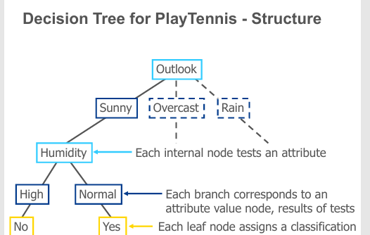


## 第一张：什么是好的决策树

### 核心问题

**决策树可能人类可读，但不使用人类逻辑！**

- 虽然看起来像人类的决策过程
- 但构建方法是算法驱动的，不是模仿人类思维

**如何构建能准确捕获数据的小型决策树？**

- 目标是树要小（简单）
- 同时要准确（高性能）

**学习最优决策树在计算上是难解的**

- 找到完美的决策树是NP完全问题
- 需要使用启发式方法近似求解

---

## 第二张：贪心算法

### 基本思想

==**我们可以通过简单的贪心算法获得好的决策树**==

- ==每次只考虑当前最好的选择==
- ==不回溯，不考虑全局最优==

**调整通常是为了修正贪心选择的问题**

- 贪心算法可能陷入局部最优
- 需要后续的剪枝等操作改进

---

### 递归构建过程

**步骤1：选择"最佳"变量**

- 选择最有区分度的特征
- 为每个可能的取值生成子节点

**步骤2：划分样本**

- 使用该特征的可能取值划分样本
- 将这些样本子集分配给对应的子节点

**步骤3：递归处理**

- 对每个子节点重复上述过程
- 直到某个节点的所有样本都是正类或都是负类


三种决策树：
合取
析取
异或

# ID3算法：决策树构建

## 第一张：ID3自顶向下归纳算法

### 算法步骤

**1. A ← 为下一个节点选择"最佳"决策属性**

- 评估所有候选属性
- 选择信息增益最大的

**2. 将A指定为该节点的决策属性**

- 该节点现在基于属性A进行分裂

**3. 对于A的每个值，创建新的后代节点**

- A有多少个可能值，就创建多少个子节点

**4. 根据分支的属性值将训练样本分配到叶节点**

- 每个样本根据其在A上的取值，被送到对应的子节点

**5. 检查是否完成**

- 如果所有训练样本都被完美分类（目标属性值相同）→ 停止
- 否则 → 在新的叶节点上迭代


==就是说每个节点都选择信息增益最大的==

---

## 第二张：变量选择

### 分割的最佳变量

**目标：最有信息量的变量**

- 选择对标签最有信息量的变量
- 信息量化方法由Claude Shannon提出

---

### 基本概念

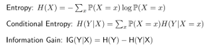
---

#### 1. 熵（Entropy）

H(X)=−∑xP(X=x)log⁡P(X=x)H(X) = -\sum_x P(X=x) \log P(X=x)H(X)=−x∑​P(X=x)logP(X=x)

**含义**：

- ==衡量随机变量X的不确定性==
- ==数据越混乱，熵越高==
- ==数据越纯净，熵越低==

**范围**：

- 最小值：0（完全确定）
- 最大值：log₂(n)，n是类别数（二分类时最大为1）

---

#### 2. 条件熵（Conditional Entropy）

H(Y∣X)=∑xP(X=x)H(Y∣X=x)H(Y|X) = \sum_x P(X=x) H(Y|X=x)H(Y∣X)=x∑​P(X=x)H(Y∣X=x)

**含义**：

- ==给定特征X后，目标Y的剩余不确定性==
- ==知道X的信息后，关于Y还有多少不确定性==
- ==条件熵越小，说明X对预测Y越有帮助==

**计算过程**：

1. 对X的每个取值x，计算H(Y|X=x)
2. 按P(X=x)加权求和
3. 得到平均的条件熵

---

#### 3. 信息增益（Information Gain）

IG(Y;X)=H(Y)−H(Y∣X)IG(Y;X) = H(Y) - H(Y|X)IG(Y;X)=H(Y)−H(Y∣X)

**含义**：

- ==使用特征X后，关于Y的不确定性减少了多少==
- ==等于分割前的熵减去分割后的条件熵==
- ==信息增益越大，特征X越重要==

**决策准则**： **选择信息增益最高的变量作为分割特征**

---

## 第三张：熵的定义（重复）

### 符号说明

**S**：训练样本的集合 **p₊**：正样本的比例 **p₋**：负样本的比例

### 熵的作用

==**熵衡量S的不纯度（impurity）**==

- ==不纯度 = 混乱程度 = 不确定性==
- ==纯净的数据集熵值低==
- ==混乱的数据集熵值高==

### 公式

Entropy(S)=−p+log⁡2p+−p−log⁡2p−\text{Entropy}(S) = -p_+ \log_2 p_+ - p_- \log_2 p_-Entropy(S)=−p+​log2​p+​−p−​log2​p−​

### 熵曲线

**图形特征**：

- 横轴p从0到1（正样本比例）
- 纵轴entropy从0到1
- 曲线呈倒U型（抛物线状）

**关键点**：

- **p=0**：熵=0（全是负样本，完全确定）
- **p=0.5**：熵=1（正负各半，最不确定）
- **p=1**：熵=0（全是正样本，完全确定）
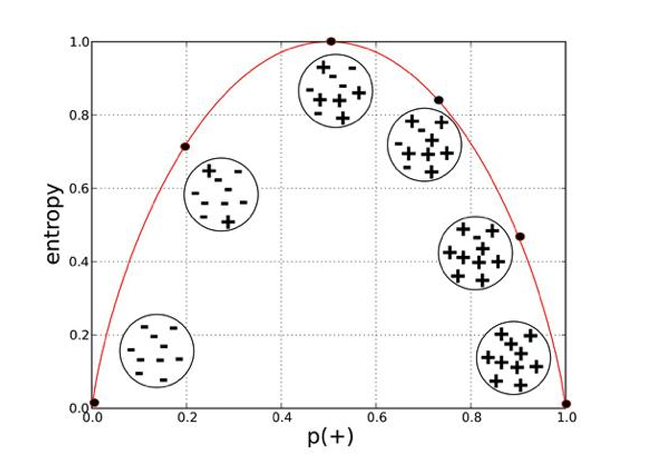


# 决策树的高级问题

## 第一张：连续值属性

### 问题

**如何处理连续值属性？**

**示例**：Temperature = 24.50C

- 温度是连续变量，不是离散类别
- 不能直接用于ID3算法

---

### 解决方案：创建离散属性

**方法：设置阈值**

**示例**：

```
(Temperature > 20.00C) = {true, false}
```


**问题**：**阈值设在哪里？**
### 详细算法

**步骤1：排序并标记变化点**

```
15(No), 18(No) | 19(Yes), 22(Yes), 24(Yes) | 27(No)
              ↑                            ↑
           阈值1候选                    阈值2候选
```

**步骤2：计算每个候选阈值的信息增益**

```
候选1：T > 18.5
- 左边：[15, 18] → 2个No
- 右边：[19, 22, 24, 27] → 3个Yes, 1个No

候选2：T > 25.5
- 左边：[15, 18, 19, 22, 24] → 3个Yes, 2个No
- 右边：[27] → 1个No
```

**步骤3：选择最佳阈值**

- 计算两个候选的信息增益
- 选择信息增益更大的


## 第二张：未知属性值

### 问题

**如果某些样本的某些属性值缺失怎么办？**

---

### 解决方案

#### 方案1：忽略缺失值

```
✓ 仍然使用该训练样本
✓ 让它通过决策树
✓ 如果节点n测试属性A，为A的其他值（在节点n排序的其他样本中）分配最常见的值
```

**示例**：

```
节点测试Humidity
该样本Humidity缺失
其他到达该节点的样本：7个High，3个Normal
→ 将该样本的Humidity设为High（最常见）
```

---

#### 方案2：最常见值（目标相同）

```
✓ 在具有相同目标值的其他样本中
✓ 分配属性A的最常见值
```

**示例**：

```
样本的PlayTennis=Yes，但Humidity缺失
其他PlayTennis=Yes的样本：4个High，5个Normal
→ 将Humidity设为Normal（在Yes类中最常见）
```

---

#### 方案3：概率分配

```
✓ 为属性A的每个可能值vi分配概率pi
✓ 将样本的pi比例分配给树的每个后代
✓ 以同样方式对新样本分类
```

**示例**：

```
Humidity缺失
到达该节点的样本：60%为High，40%为Normal

处理方式：
- 0.6的样本"权重"走High分支
- 0.4的样本"权重"走Normal分支

最终预测：结合两个分支的结果，按权重加权
```


决策树最大的问题之一是过拟合

# 避免过拟合 - 核心要点

## 第一张：两种策略

### 预剪枝

**当分割无统计显著性时停止生长**

### 后剪枝（推荐）

**先生长完整树，然后剪枝**

---

## 选择最佳树

**三种方法**：

1. ❌ 训练数据性能 - 会选择过拟合的树
2. ✅ **独立验证集性能** - 推荐
3. ✅ **min(|tree| + |错误数|)** - MDL原则

---

## 第二张：具体方法

### 思路1：预剪枝

**当误差改善 < 阈值时停止**

### 思路2：后剪枝

**最弱链剪枝（REP）**

- 从大树开始
- 从叶到根评估每个节点
- 删除对验证性能影响最小的子树


# 第一节第二部分：随机森林


# 集成学习

## 第一张：集成学习概述

### 决策树的问题

**决策树可能简单，但常常过拟合且方差高**

---

### ==集成学习的核心思想==

==**多个头脑一起工作通常能取得更好的结果**==

**统计直觉**： 平均多个测量值可以得到更稳定可靠的结果

---

### 关键概念

**模型组合：模型集成**

- 结合多个模型的预测
- 通过投票或平均得到最终结果

**特点**：

- 强大
- 但增加了算法和模型复杂度

---

## 第二张：模型平均方法

### 三种主要方法

#### 1. Bagging（装袋法）

**Breiman, 1996**

**方法**：

- 对训练数据进行自助重采样（bootstrap）
- 在每个重采样版本上训练大型树
- 通过多数投票分类

**特点**：

- 减少方差
- 并行训练
- 每棵树独立

==每个袋子有放回抽取固定数量样本，在每个bootstrap样本上独立训练一棵树，多数投票==

---

#### 2. Boosting（提升法）

**Freund & Shapire, 1996**

**方法**：

- 训练多棵大树或小树
- 使用重新加权的训练数据版本
- 通过加权多数投票分类

**特点**：

- 顺序训练
- 每棵树关注前面树的错误
- 逐步提升性能
==顺序训练多个弱学习器，每个学习器关注前面学习器的错误==
最终模型： - 所有树的加权组合 - 早期树权重大，后期树权重可能小


---

#### 3. Random Forests（随机森林）

**Breiman 1999**

**方法**： Bagging的更花哨版本

**关系**：

```
Boosting > Random Forests > Bagging > Single Tree
复杂度和效果递增
```

---


# 随机森林（Random Forest）

## 第一张：为什么需要随机森林

### Bagging的问题

**决策树的贪心特性**：

- 使用贪心算法选择分割变量
- 最小化误差
- ==即使使用Bagging，决策树仍有很多结构相似性==
- 导致预测之间高度相关

---

### ==集成学习的关键==

==**组合多个模型的预测在子模型预测不相关或弱相关时效果最好**==

==---==

### ==随机森林的改进==

==**改变子树的学习算法，使所有子树的预测相关性更低**==

---

## 第二张：随机森林的方法

### 同时对特征和样本进行Bagging

**三个关键机制**：

---

#### 1. 特征随机采样

==**在每次树分裂时，随机抽取m个特征**==

- 只考虑这m个特征用于分裂
- 通常 m=dm = \sqrt{d} m=d​ 或 log⁡2d\log_2 d log2​d（d是总特征数）

**示例**：

```
总特征：100个
每次分裂只看：√100 = 10个特征
```

---

#### 2. 袋外错误率（OOB）

==**对于每棵树在bootstrap样本上训练后**：==

- ==监控未被抽到的样本（袋外样本）的错误率==
- ==称为"袋外"错误率==

**作用**：

- 免费的验证集
- 无需单独划分数据

---

#### 3. 去相关策略

**随机森林通过"去相关"树来改进Bagging**

- 每棵树有相同的期望性能
- 但树之间更加独立
- 降低预测相关性


## 总结

### 随机森林 = Bagging + 特征随机化

==**核心改进**：==

```
Bagging：样本随机化
随机森林：样本随机化 + 特征随机化
```

**效果**：

```
更低的树间相关性
→ 更好的方差减少
→ 更高的准确率
```


# 随机森林的特点与优势

## 第一组优势

### 1. 高准确率

**最准确的学习算法之一**

- 在许多数据集上产生高度准确的分类器

### 2. 高效运行

**在大数据库上运行高效**

### 3. 处理高维数据

**可以处理数千个输入变量，无需变量删除**

---

## 第二组优势

### 4. 特征重要性

**给出变量在分类中的重要性估计**

- 自动排序特征重要性

### 5. 泛化误差估计

**在构建森林时生成泛化误差的内部无偏估计**

- 通过袋外（OOB）错误率实现

### 6. 处理缺失值

**有效估计缺失数据的方法**

- 即使大部分数据缺失也能保持准确性

---

## 第三组优势

### 7. 处理不平衡数据

**有方法平衡类别不平衡数据集中的错误**

### 8. 模型可重用

**生成的森林可以保存用于未来其他数据**

### 9. 可解释性

**计算的原型给出变量与分类之间关系的信息**


==**准确性**：最高准确率之一 **效率**：快速训练和预测 **鲁棒性**：处理缺失值、异常值、高维数据 **可解释**：特征重要性、原型分析 **实用性**：易用、可保存、适应性强==


# 第二节：Clustering


无监督学习的本质是让算法自主探索数据，**不依赖人工标注**，从原始数据中自动发现有价值的模式、结构和知识。这使其在处理大量未标注数据时特别有用，是人工智能领域的重要技术分支。


# 聚类分析 (Clustering) 详解

## 一、聚类的基本概念

**定义特征：**

- 属于无监督学习方法
- 只需要数据，不需要标签
- 目标是检测数据中的模式

## 二、聚类的动机与应用

### 1. **探索性数据分析 (Exploratory Data Analysis)**

- 理解数据的整体特征
- 数据可视化
- 发现数据的内在结构

### 2. **泛化推断 (Generalization)**

- 基于实例之间的关系进行推断
- 例如：根据基因与其他基因的相似性来推断该基因的功能

## 三、聚类算法范式

### **1. 扁平算法 (Flat Algorithms)**

**特点：**

- 通常从随机的（部分）划分开始
- 通过迭代优化进行改进

**主要方法：**

- **K均值聚类 (K-means clustering)** - 基于距离的划分方法
- **基于模型的聚类 (Model-based clustering)** - 使用概率模型
- **谱聚类 (Spectral clustering)** - 基于图论的方法

==**示意图特征：** 显示为平行的、非嵌套的簇结构==

### **2. 层次算法 (Hierarchical Algorithms)**

**自底向上 (Bottom-up, Agglomerative)：**

- 从每个数据点作为独立簇开始
- 逐步合并相似的簇

**自顶向下 (Top-down, Divisive)：**

- 从所有数据作为一个簇开始
- 逐步分裂成更小的簇

==**示意图特征：** 显示为树状结构（树状图/dendrogram）==

## 总结

聚类是无监督学习的核心技术，主要分为两大范式：

- ==**扁平算法**适合已知簇数量或需要快速划分的场景==
- ==**层次算法**适合需要了解数据多层次结构或不确定簇数量的场景==

选择算法时需考虑数据特性、计算效率和应用需求。


# 聚类范式与应用详解

## 一、聚类的两种范式

### **1. 硬聚类 (Hard Clustering)**

- **定义：** 每个样本只能属于一个簇
- **特点：** 划分明确，互不重叠
- **适用场景：** 需要明确分类的情况

### **2. 软聚类 (Soft Clustering)**

- **定义：** 一个样本可以同时属于多个簇（基于概率）
- **优势：** 更符合实际应用场景

**应用示例：**

- **创建可浏览的层次结构** - 允许对象在多个类别中出现
- **运动鞋分类问题** - 一双运动鞋可能同时归属于：
    - (i) 运动服饰类
    - (ii) 鞋类这种多重归属更符合实际分类需求


# K均值聚类算法详解

## 一、聚类的基本思想

**核心目标：** 将相似的数据点（实例）分组到一起

**三个关键问题：**

1. ✓ **相似性的含义是什么？** - 需要定义"相似"的标准
2. **如何度量相似性？** - 选择合适的距离或相似度度量方法
3. **需要多少个簇？** - 确定聚类的数量K

## ==二、K均值算法 (K-means)==

### **算法地位**

最著名和最流行的聚类算法

### **算法步骤**

**Step 1: 初始化**

- 从数据中随机选择k个点作为初始簇中心

**Step 2: 迭代过程**

- **分配步骤：** 将每个样本分配给最近的簇中心
- **更新步骤：** 重新计算并更新簇中心为该簇内所有点的均值

**Step 3: 停止条件**

- 当没有任何点的簇分配发生改变时停止


# K均值算法：距离度量与中心计算详解

## 第一部分：距离度量 (Distance Measures)

### **欧氏距离 (Euclidean Distance)**

**公式：**

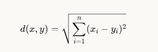

**含义：**

- 计算两点之间的直线距离
- n 是特征维度数
- (xi−yi)(x_i - y_i) (xi​−yi​) 是各维度的差值

**适用场景：**

> "good for spatial data" （适合空间数据）

**解释：**

- 特别适合地理坐标、物理位置等空间数据
- 反映了我们日常理解的"距离"概念
- 是K均值算法最常用的距离度量


## 第四部分：中心计算公式

### **簇中心计算公式**

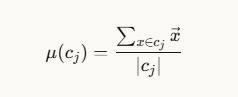

**符号说明：**

- μ(cj)\mu(c_j) μ(cj​) = 第 j 个簇的中心（均值向量）
- cjc_j cj​ = 第 j 个簇
- x⃗\vec{x} x = 簇中的每个数据点（向量）
- ∣cj∣|c_j| ∣cj​∣ = 簇中数据点的数量
- ∑\sum ∑ = 对簇内所有点求和

**计算步骤：**

1. 取簇 cjc_j cj​ 中所有数据点
2. 将这些点的坐标分别相加（向量加法）
3. 除以点的总数量
4. 得到的结果就是新的簇中心


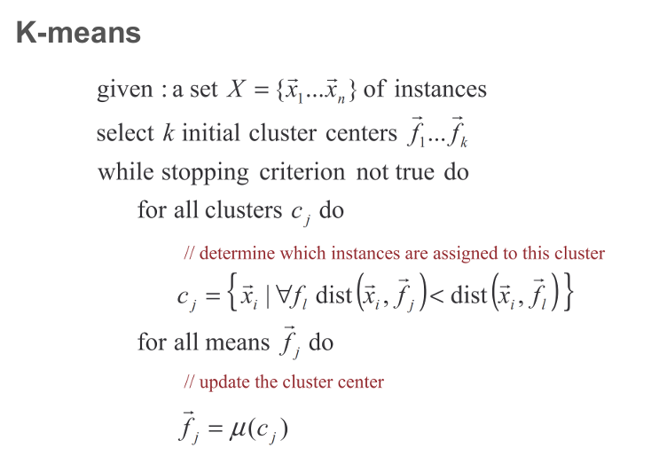


### 关键理解：
==距离就是纵横格子差值之和==
==中心点就是==
==x坐标之和/数量==
==y坐标之和/数量==


# K均值算法：性质、变体与参数详解

## 第一部分：K均值算法的核心性质

### **1. 收敛保证 (Convergence Guarantee)**

> "Guaranteed to converge in a finite number of iterations"

**含义：**

- 算法**一定会停止**，不会无限循环
- 在有限步骤内达到稳定状态


---

### **2. 时间复杂度 (Running Time per Iteration)**

#### **步骤1：分配数据点**

```
分配数据点到最近的簇中心
时间复杂度：O(KN)
```


**示例：**

```
如果有 1000个数据点，3个簇：
计算次数 = 1000 × 3 = 3000 次距离计算
```

---

#### **步骤2：更新簇中心**

```
将簇中心更新为分配点的平均值
时间复杂度：O(N)
```

	

**示例：**

```
1000个点，3个簇：
遍历1000个点 = O(1000) = O(N)
```

---

**单次迭代总时间：**

```
O(KN) + O(N) = O(KN)
（因为 K 通常较小，O(KN) 主导）
```

**完整算法时间：**

```
O(I × K × N)
其中 I = 迭代次数（通常很小，如 10-100）
```

---

## 第二部分：K均值的变体与参数


> "What are some other variations/parameters we haven't specified?" （还有哪些我们没有指定的变体/参数？）

---

# K均值选择K值：肘部法则

## 核心概念

**肘部法则 (Elbow Method)**：通过对不同K值拟合模型，找到SSE开始线性下降的"肘部点"。

---

## SSE公式

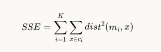

**含义：** 所有点到其簇中心的距离平方和

---

## 计算示例

**假设 K=2：**

**簇1：** 中心(2,2)，点(1,1), (2,3), (3,2)

- dist²(1,1 → 2,2) = (1-2)² + (1-2)² = 2
- dist²(2,3 → 2,2) = 0 + 1 = 1
- dist²(3,2 → 2,2) = 1 + 0 = 1
- **簇1误差 = 4**

**簇2：** 中心(8,8)，点(7,7), (9,8), (8,9)

- 同样计算得 **簇2误差 = 4**

**总SSE = 8**

---

## 肘部曲线图

```
SSE
100|●
 80|  ╲
 60|    ╲
 40|      ●___肘部(K≈3)
 20|          ───●──●──●
  0+─────────────────────
   1  2  3  4  5  6  7  K
```

**特征：**

- K=1→3：陡降（每增加簇效果显著）
- K≈3：肘部拐点
- K>3：平缓（继续增加簇收益递减）


# K均值初始化策略

## 问题：随机初始化的风险

**图示场景：**

- 蓝色点：数据点
- 彩色方块：初始簇中心（红、蓝、紫）

**关键问题：**

> "What would happen here? Seed selection ideas?"

图中3个初始中心都聚集在中间区域，可能导致差的聚类结果。

---

## 种子选择的影响

**核心问题：**

- 结果会因随机种子选择而剧烈变化
- 差的种子导致收敛慢或次优聚类

---

## 常见初始化启发式方法

### **1. 空间随机中心 (Random centers in space)**

在数据空间范围内随机生成点

### **2. 随机选择样本 (Randomly pick examples)**

从数据集中随机选择K个点

### **3. 最远点启发式 (Furthest centers heuristic)**

选择彼此距离最远的点

### **4. 多次尝试 (Try out multiple starting points)** ⭐

运行多次，选最优结果

### **5. 其他聚类方法初始化**

用层次聚类等方法的结果初始化


## ==最远点启发式详解==

### **算法步骤：**

```
μ₁ = 随机选一个点

for i = 2 to K:
    μᵢ = 选择距离所有已有中心最远的点
```

### **数学公式：**

μi=arg⁡max⁡xmin⁡μj:1<j<id(x,μj)\mu_i = \arg\max_{x} \min_{\mu_j : 1 < j < i} d(x, \mu_j)μi​=argxmax​μj​:1<j<imin​d(x,μj​)

**解释：**

- 内层min：点x到所有已有中心的最小距离
- 外层argmax：选择这个最小距离最大的点

==**白话：** 选"离最近中心也最远"的点==

## 可视化理解

### **过程演示：**

```
步骤1：随机选μ₁
    ●μ₁
  ● ● ●
    ● ●

步骤2：选离μ₁最远的点作为μ₂
    ●μ₁        ●μ₂
  ● ● ●      ● ●
    ● ●

步骤3：选离μ₁和μ₂都远的点作为μ₃
    ●μ₁        ●μ₂
  ● ●μ₃●     ● ●
    ● ●
```

**结果：** 初始中心分散开，覆盖数据空间


# ==K-means++算法详解==

## 最远点方法的问题

**图示场景：**

- 左下：3个密集点群
- 右上：2个孤立点（红色、蓝色方块标记）

**关键问题：**

> "If we do a number of trials, will we get different centers?"

==**问题：** 最远点启发式可能被离群点（outliers）吸引，导致初始中心分布不均。==

---

## K-means++算法

### **核心思想**

==用**概率选择**代替确定性选择，距离越远的点被选中概率越大，但不是必然选中。==

---

## 算法步骤

### **步骤1：选择第一个中心**

```
从数据点中均匀随机选择一个点
```

### **步骤2：计算距离**

```
对每个数据点x，计算D(x)：
D(x) = x到最近已选中心的距离
```

### **步骤3：概率选择新中心**


==随机选择一个新点作为中心，选择概率与D(x)²成正比==
==即：距离已有中心越远，被选中概率越高==


### **步骤4：重复**

```
重复步骤2和3，直到选够K个中心
```

### **步骤5：标准K-means**

```
用选好的初始中心运行标准K-means
```

---


---

## 关键问题：How does this help?

### **优势分析：**

**1. 避免离群点主导**

```
最远点法：离群点必选
K-means++：离群点有较高概率，但不是100%
```

**2. 平衡覆盖**

```
密集区域的点也有机会被选为中心
距离适中的点也可能被选中
```

**3. 多样性**

```
多次运行会得到不同的初始中心
但都相对合理
```

## 概率选择示例

**假设计算得到的距离²：**

```
点A：距离² = 4  → 概率 = 4/20 = 20%
点B：距离² = 1  → 概率 = 1/20 = 5%
点C：距离² = 9  → 概率 = 9/20 = 45%
点D：距离² = 6  → 概率 = 6/20 = 30%
总和：20
```

**结果：**

- 点C（最远）最可能被选，但不是必然
- 点B（最近）也有5%机会
- 平衡了确定性和随机性


### **三大优势：**

#### **1. 可以选择其他点**

> "Makes it possible to select other points"

即使数据点数量 >> 离群点数量，也能选到好的中心点

**解释：**

- 不会被少数离群点主导
- 密集区域的点也有机会被选中

---

#### **2. 非确定性，帮助多次运行**

> "Makes it non-deterministic, which will help with random runs"

每次运行得到不同但合理的初始化

**好处：**

- 多次运行可探索不同可能性
- 降低陷入差的局部最优的风险

---

#### **3. 理论保证**

> "Nice theoretical guarantees!"

有数学证明：期望近似比为O(log K)

**意义：**

- 不只是经验性方法
- 有严格的理论支持

---

## 什么是好的聚类？

### **内部评价标准**

好的聚类应产生高质量的簇，满足：

---

### **1. 高簇内相似度 (High Intra-class Similarity)**

> "the intra-class (that is, intra-cluster) similarity is high"

**含义：** 同一簇内的点应该彼此相似

**可视化：**

```
好的簇：           差的簇：
  ●●●               ●  ●
  ●●●                 ●
  ●●●               ●  ●
(紧密聚集)         (松散分散)
```

---

### **2. 低簇间相似度 (Low Inter-class Similarity)**

> "the inter-class similarity is low"

**含义：** 不同簇之间应该差异明显

**可视化：**

```
好的分离：         差的分离：
簇1    簇2         簇1 簇2
●●●   ●●●         ●●● ●●●
●●●   ●●●         ●●●●●●
(明显分开)         (粘在一起)
```


==也就是低耦合高内聚==

---

### **质量依赖因素**

> "The measured quality of a clustering depends on both the document representation and the similarity measure used"

聚类质量取决于：

1. **文档/数据表示方式**
2. **相似度度量方法**


## 聚类评估指标

### **1. 簇内内聚度 (Intra-cluster Cohesion/Compactness)**

衡量簇内数据点与簇中心的接近程度

**常用指标：** SSE（误差平方和）

---

### **2. 簇间分离度 (Inter-cluster Separation/Isolation)**

不同簇的中心应相距较远

---

### **3. 专家判断**

> "In most applications, expert judgments are still the key"

实际应用中，领域专家的评估仍是关键


## K-means的局限性

### **1. K值难以确定**

有时簇数量难以预先判断

### **2. 不适合非规则形状簇**

对不规则或复杂形状的簇效果差

**图示：** 圆形数据被错误地分成扇形簇

### **3. 对离群点敏感**

包含离群点的数据会影响聚类质量


# 层次聚类 (Hierarchical Clustering)

## 定义

### **是什么？**

- 无监督机器学习方法
- 本质上是构建簇的层次结构

---

## 类型

### **1. 凝聚型 (Agglomerative)**

自底向上：从单个点开始逐步合并

### **2. 分裂型 (Divisive)**

自顶向下：从整体开始逐步分裂

---


---

## 链接准则 (Linkage Criteria)

### **核心问题：**

如何计算簇之间的距离？

---

### **选项：**

**1. 单链接 (Single-linkage)** 两簇最相似点之间的距离

```
簇A     簇B
● ●     ● ●
●       ●
  ↔ 最短距离
```

**2. 全链接 (Complete-linkage)** 两簇最不相似点之间的距离

```
簇A     簇B
● ●     ● ●
●       ●
← 最长距离 →
```

**3. 平均链接 (Mean/Average-linkage)** 簇中心之间的距离

**4. 其他准则** 根据具体需求定义
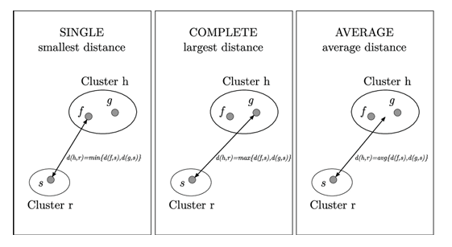


## 凝聚聚类算法步骤

### **算法流程：**

**1. 计算邻近度矩阵**

```
计算所有点对之间的距离
```

**2. 初始化**

```
每个数据点作为一个独立的簇
```

**3. 迭代合并**

```
重复：合并最近的两个簇，并更新邻近度矩阵
```

**4. 终止条件**

```
直到只剩下一个簇
```
## 示例过程

```
初始: ●₁ ●₂ ●₃ ●₄ ●₅ ●₆  (6个簇)

步骤1: 合并最近的两个
      (●₁●₂) ●₃ ●₄ ●₅ ●₆  (5个簇)

步骤2: 继续合并
      (●₁●₂) ●₃ (●₄●₅) ●₆  (4个簇)

步骤3: ...
      ((●₁●₂)●₃) (●₄●₅) ●₆  (3个簇)

...继续直到只剩1个簇
```


例子：
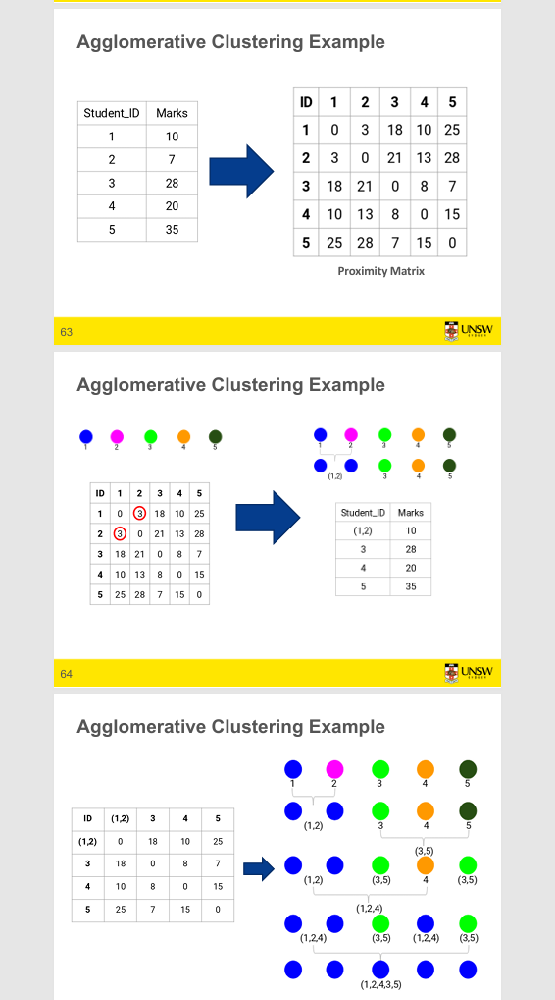


## 如何选择簇的数量？

### **使用树状图 (Dendrogram)**

**方法：**

1. **树状图定义**
    - 树状结构图，记录合并或分裂的顺序
2. **高度含义**
    - 两簇合并时，连接点的高度 = 簇间距离
3. **设置阈值**
    - 画一条水平线（阈值线）
    - 尽量让这条线穿过最长的垂直线
4. **确定簇数**
    - 簇数 = 阈值线穿过的垂直线数量

## 层次聚类的优缺点

### **✅ 优点**

**1. 易于实现**

- 算法简单直观

**2. 不需要预先指定簇数量**

- 通过树状图事后选择
- 可灵活调整

---

### **❌ 缺点**

**1. 不适合大数据集**

- 时间复杂度：O(n²) 到 O(n³)
- 空间复杂度：O(n²)（存储距离矩阵）

**2. 对离群点敏感**

- 离群点会影响合并过程

**3. 初始种子影响大**

- 虽然不需要预设K，但链接准则的选择很关键

**4. 链接准则和距离度量选择**

- 通常是任意选择
- 对结果影响很大


# 第三部分：Recommender System


## 推荐系统作为函数

### **输入 (Given):**

**1. 用户模型**

- 评分 (ratings)
- 偏好 (preferences)
- 人口统计信息 (demographics)
- 情境信息 (situational context)

**2. 物品**

- 可包含或不包含物品特征描述

---

### **输出 (Find):**

**相关性分数 (Relevance score)**

- 用于排序推荐结果

---

## 与信息检索的关系

**信息检索 (IR):**

> "IR is finding material ... of an unstructured nature ... that satisfies an information need from within large collections ..."
> 
> — Manning et al. 2008

**相似点：**

- 都从大量候选中找到相关内容
- 都需要排序和相关性评分
- 都处理用户需求匹配问题

**区别：**

- IR：基于查询的主动搜索
- RS：基于历史的被动推荐

---


==推荐系统 = 预测用户对物品的兴趣程度，并生成排序列表==


**核心理念：** 不只推荐热门，更要推荐**适合**的


## 搜索 vs 推荐系统

### **核心区别**

> "You don't need to look for the products and services, the products/services find you"
> 
> 不是你找产品，而是产品找你

---

### **对比分析**

**搜索：**

- 需要用户**主动**输入关键词
- 明确表达需求

**推荐系统：**

- **隐式**获取需求
- 不需要搜索词
- 主动推送


## 推荐系统何时表现良好？

### **成功指标：**

**1. 推荐广泛未知但用户可能喜欢的物品**

> "Recommend widely unknown items that users might actually like!"

**2. 从长尾推荐**

```
流行度
 ↑
 │█ 头部
 │█╲___推荐这里
 │    ╲_________
 │           长尾
 └──────────────→ 产品
```

**3. 数据支撑**

- 20%的物品获得74%的正面评分
- MovieLens 100K数据集中，评分>3的物品


# ==三种主要推荐系统的特点、优势和局限性：==
## 一、协同过滤 (Collaborative Filtering)

### **核心思想**

"Tell me what's popular among my peers"（告诉我同类人喜欢什么）

### **工作原理**

- **输入**：用户-物品评分矩阵 + 社区数据
- **假设**：过去口味相似的用户，未来口味也相似
- **方法**：
    - **基于用户**：找相似用户，用他们的评分预测
    - **基于物品**：找相似物品，用用户对这些物品的评分预测

### **优势**

✓ 不需要物品内容信息 ✓ 完全基于用户行为 ✓ 能发现意外的推荐（用户可能没想到的） ✓ 利用"群体智慧"

### **局限性**

❌ **冷启动问题**：新用户/新物品没有足够评分 ❌ **数据稀疏性**：评分矩阵极度稀疏（Netflix仅1.8%非零） ❌ **流行度偏差**：倾向推荐热门物品，忽视长尾 ❌ **可扩展性**：用户/物品数量大时计算复杂

---

## 二、基于内容 (Content-based)

### **核心思想**

"Show me more of the same what I've liked"（给我看更多我喜欢的同类内容）

### **工作原理**

- ==**输入**：用户画像 + 产品特征（关键词、属性）==
- **方法**：计算未见物品与用户历史偏好的相似度
- **相似度计算**：Dice系数、余弦相似度等

### **优势**

✓ 解决新物品冷启动问题 ✓ 不依赖其他用户数据 ✓ 可解释性强（基于特征匹配） ✓ 用户偏好稳定时效果好

### **局限性**

❌ **关键词不足以判断质量/相关性**

- 无法评估时效性、美学、写作风格
- 多媒体内容难以自动提取

❌ **仍需要训练数据**

- 需要用户的历史评分/行为数据
- 新用户仍有冷启动问题

❌ **过度专业化（Overspecialization）**

- 只推荐与历史相似的内容
- 缺乏多样性和惊喜
- 陷入"过滤气泡"（Filter Bubble）

---

## 三、基于知识 (Knowledge-based)

### **核心思想**

"Tell me what fits based on my needs"（根据我的需求告诉我什么合适）

### **工作原理**

- **输入**：用户需求 + 产品特征 + 领域知识/规则
- **方法**：基于约束匹配和推理

### **优势**

✓ 解决冷启动问题（不依赖历史数据） ✓ 适合复杂决策（如房产、汽车） ✓ 可结合领域专家知识

### **局限性**

❌ 需要构建知识库（成本高） ❌ 难以捕捉个性化偏好 ❌ 维护困难


# 推荐系统的三大范式

## 1. 协同过滤 (Collaborative Filtering)

> "Tell me what's popular among my peers"

**输入：**

- 用户画像 & 情境参数
- **社区数据**（其他用户的行为）

**核心思想：** 基于相似用户的喜好推荐

---

## 2. 基于内容 (Content-based)

> "Show me more of the same what I've liked"

**输入：**

- 用户画像 & 情境参数
- **产品特征**（物品的属性）

**核心思想：** 推荐与用户历史喜好相似的物品

---

## 3. 基于知识 (Knowledge-based)

> "Tell me what fits based on my needs"

**输入：**

- 用户画像 & 情境参数
- 产品特征
- **知识模型**（领域规则、约束）

**核心思想：** 基于用户需求和领域知识匹配


# 协同过滤 (Collaborative Filtering)

## 定义

**最主流的推荐方法**

**应用：**

- 大型商业电商网站广泛使用
- 算法成熟，有多种变体
- 适用于多个领域（书籍、电影、DVD等）

---

## 核心思想

**方法：** 利用"群体智慧"推荐物品

**基本假设：**

- 用户对目录物品评分（隐式或显式）
- 过去口味相似的用户，未来也会有相似口味

---

## 纯协同过滤方法

### **输入**

仅需用户-物品评分矩阵

### **输出类型**

**1. 数值预测** 预测当前用户对某物品的喜爱程度

**2. Top-N推荐列表** 推荐N个最可能喜欢的物品

---

## 关键特点

- 不需要物品内容信息
- 完全基于用户行为数据
- "协同"体现在利用群体评分模式


# 基于用户的最近邻协同过滤

## 基本技术 (1)

### **方法步骤**

给定"活跃用户"Alice和物品i（Alice未见过）：

1. **找相似用户**
    - 找到一组用户（邻居）
    - 他们过去与Alice喜欢相同物品
    - 且已评分物品i
2. **预测评分**
    - 使用邻居评分的平均值预测Alice对物品i的评分
3. **生成推荐**
    - 对Alice未见过的所有物品重复上述过程
    - 推荐评分最高的物品

---

### **基本假设**

- ==过去口味相似 → 未来口味也相似==
- ==用户偏好稳定且一致==

---

## 示例 (2)

### **评分矩阵**

```
       Item1 Item2 Item3 Item4 Item5
Alice    5     3     4     4     ?
User1    3     1     2     3     3
User2    4     3     4     3     5
User3    3     3     1     5     4
User4    1     5     5     2     1
```

**任务：** 预测Alice对Item5的评分

---

## 关键问题 (3)

### **需要解决的问题**

1. **如何度量相似性？**
    - 选择相似度计算方法
2. **考虑多少邻居？**
    - K值的选择
3. **如何从邻居评分生成预测？**
    - 聚合策略（平均、加权平均等）

---


# 用户相似度度量与预测

## ==度量用户相似度 (1)==

### **Pearson相关系数**

**符号：**

- a, b：用户
- r_a,p：用户a对物品p的评分
- p：a和b都评分过的物品集合

**公式：**

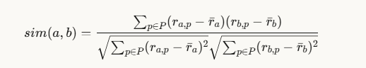

**取值范围：** -1 到 1

---

## 相似度计算示例 (2)

### **评分矩阵**

```
       Item1 Item2 Item3 Item4 Item5
Alice    5     3     4     4     ?
User1    3     1     2     3     3   sim=0.85
User2    4     3     4     3     5   sim=0.99
User3    3     3     1     5     4   sim=0.70
User4    1     5     5     2     1   sim=0.79
```

**User2与Alice最相似 (0.99)**

---

## 生成预测

### **常用预测函数**

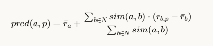

**步骤：**

1. **计算偏差**
    - 邻居对未见物品的评分是否高于/低于其平均值
2. **加权组合**
    - 用相似度作为权重组合评分差异
3. **调整基准**
    - 加上/减去活跃用户的平均评分偏差
    - 得到最终预测

---

## 核心思想

==**相似度 → 权重 → 加权平均预测**==

==越相似的用户，其评分影响越大==


## 改进度量/预测函数

### **问题：不是所有邻居评分都同等"有价值"**

==**对常见喜爱物品的一致 < 对争议物品的一致**==

---

### **改进方案**

**1. 方差加权**

- 给方差更高的物品更大权重

**2. 共同评分数量**

- 使用"显著性权重"
- 共同评分少时线性降低权重

**3. Case放大**

- 直觉：相似度接近1的邻居给更多权重

**4. 邻居选择**

- 使用相似度阈值或固定邻居数量

---


## ==基于物品的协同过滤==

### **核心思想**

==**使用物品间相似度（而非用户间）来预测**==

---

### **示例**

```
       Item1 Item2 Item3 Item4 Item5
Alice    5     3     4     4     ?
User1    3     1     2     3     3
User2    4     3     4     3     5
User3    3     3     1     5     4
User4    1     5     5     2     1
```

**步骤：**

1. 找与Item5相似的物品（如Item4）
2. 用Alice对这些物品的评分预测Item5

---

## 基于物品方法的预处理

### **优势**

**解决可扩展性问题**

**Amazon方法(2003)：**

- 预先计算所有物品对的相似度
- 运行时邻居集通常较小（只考虑用户评过的物品）
- 物品相似度比用户相似度更稳定

---

### **内存需求**

**理论：** N²对物品相似度（N=物品数）

**实践：** 显著降低

- 无共同评分的物品对不存储
- 设置最小共同评分阈值
- 限制邻居数量（可能影响准确性）


|特性|基于用户|基于物品|
|---|---|---|
|相似度|用户间|物品间|
|稳定性|较低|较高|
|可扩展性|差|好（可预计算）|
|适用场景|用户少|物品少|


# 协同过滤：隐式评分、稀疏性与局限性

## 隐式评分

### **定义**

由网站或应用自动收集的用户行为

**示例：**

- 购买行为 → 正面评分
- 点击、页面浏览、停留时间
- 下载、演示请求

---

### **优势**

- 持续自动收集
- 无需用户额外操作

---

### **主要问题**

==**无法确定行为是否被正确解释**==

**例子：**

- 用户可能不喜欢买的所有书
- 可能为别人购买

==**解决方案：** 隐式+显式评分结合使用，但需验证解释正确性==

---

## 数据稀疏性问题

### **典型案例：Netflix Prize**

```
用户-物品评分矩阵：
17,700列 × 6500M位置 = 8500M个位置
实际评分：仅100M个（约1.8%非零）
```

**极度稀疏！**

---

### **冷启动问题**

**如何推荐新物品？新用户怎么办？**

**直接方法：**

- 要求用户评分一组物品
- 其他方法：基于内容、人口统计、非个性化
- 默认投票（Breese et al. 1998）

---

### **改进方案**

**更好的算法（超越最近邻）：**

**例子：** 最近邻可能因相似邻居太少而失效

**解决思路：**

- 假设邻域"传递性"
- 使用矩阵分解等高级方法

---

## 协同过滤的局限性

### **1. 冷启动 (Cold Start)**

- 需要足够的用户和评分才能找到匹配
- 新物品需要足够评分

### **2. 流行度偏差 (Popularity Bias)**

- 难以推荐给口味独特的用户
- 倾向推荐热门物品，长尾物品数据少

### **3. 数据稀疏性**

- 评分矩阵极度稀疏
- 影响相似度计算准确性

---

## 总结

**协同过滤的核心挑战：**

- 数据质量（隐式评分解释）
- 数据数量（稀疏性）
- 系统启动（冷启动）
- 推荐多样性（流行度偏差）

**需要结合其他方法（混合推荐）来克服这些局限**


# 基于内容的推荐系统

## 核心思想

### **与协同过滤的区别**

**协同过滤：** 不需要物品信息 **基于内容：** 需要物品信息

**优势：**

- 可推荐给过去喜欢奇幻小说的人
- 利用物品属性（"内容"）

---

### **所需信息**

1. 物品的内容信息（如类型）
2. 用户画像（描述用户喜好）

---

### **任务**

1. 学习用户偏好
2. 定位/推荐与用户偏好"相似"的物品

**流程图：**

```
用户偏好 + 物品特征 → 推荐组件 → 推荐列表
      ↑                    ↓
      └─── 学习用户偏好 ───┘
```

---

## 什么是"内容"？

### **文本文档**

**最初应用：** 推荐文本文档（网页、新闻消息）

**物品内容表示为文本：**

---

### **结构化描述**

**每个物品由相同属性集描述**

**示例：书籍属性表**

```
| Title | Genre | Author | Type | Price | Keywords |
|-------|-------|--------|------|-------|----------|
| 书名  | 类型  | 作者   | 类别 | 价格  | 关键词    |
```

---

### **非结构化**

**自由文本描述**

---

## 内容表示与物品相似度

### **1. 物品表示**

**结构化属性表 + 关键词**

---

### **2. 用户画像**

**关键词向量：** keyword(b₁) 描述书籍，包含关键词集合

---

### **3. 简单方法**

**计算未见物品与用户关键词的相似度：**

相似度=2×∣Keyword(bi)∩Keyword(bj)∣∣Keyword(bi)∣+∣Keyword(bj)∣\text{相似度} = \frac{2 \times |Keyword(b_i) \cap Keyword(b_j)|}{|Keyword(b_i)| + |Keyword(b_j)|}相似度=∣Keyword(bi​)∣+∣Keyword(bj​)∣2×∣Keyword(bi​)∩Keyword(bj​)∣​

**例如：** 使用Dice系数

---

## 推荐物品

### **最近邻方法**

**给定用户已评分的文档集D（喜欢/不喜欢）：**

1. **找最近邻**
    - 在未见物品i中找D中的最近邻
    - 使用相似度度量（如余弦相似度）
2. **预测评分**
    - 例如：i的k个最相似物品
    - 当前用户对这k个物品中的4个评分高
    - 则i也可能被该用户喜欢

---

### **变体**

- 调整邻域大小k
- 设置上限/下限相似度阈值
- 适合建模短期兴趣/后续故事

**用于结合方法建模长期偏好**

---

## 局限性

### **1. 关键词不足以判断质量**

**可能不足以评判：**

- 时效性、可用性、美学、写作风格
- 内容可能有限/过短
- 内容可能无法自动提取（多媒体）

---

### **2. 需要启动阶段**

- 仍需要一些训练数据
- Web 2.0：使用其他来源学习用户偏好

---

### **3. 过度专业化**

**问题：**

- 算法倾向推荐"更多相同内容"
- 或：过于相似的新闻物品

---

## 总结

**基于内容推荐 = 物品特征匹配 + 用户偏好学习**

**优势：** 解决冷启动（新物品） **劣势：** 缺乏多样性、需要可提取的内容