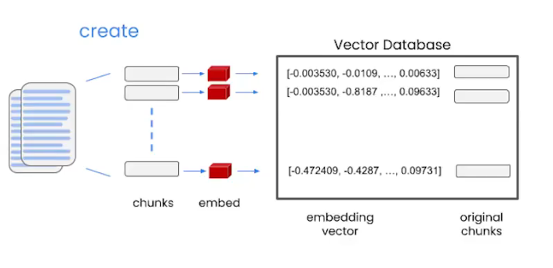

## 模型，提示和输出解析
Parser：接受输出，将输出解释成更格式化的形式

temperater，模型的随机性

langchain有一个ChatPromptTemple的库用于反复使用某个模板，而不是使用f字符串
有用的抽象，提高复用性
此外，它还支持输出解析
ReAct框架
ReAct = **Re**asoning + **Act**ing，让 LLM 像人一样"边思考边行动"地解决问题，循环执行三个步骤：

```
Thought  →  Action  →  Observation  →  Thought  →  ...
```


用 `StructuredOutputParser` 将模型返回的字符串自动解析为 Python 字典
上一步模型返回的 `response.content` 只是一个**普通字符串**，虽然内容长得像 JSON，但本质是 `str`，所以调用 `.get()` 会报 `AttributeError`。而我们想要一个dict，这就是为什么需要引入输出解析器。

第一步：定义每个字段的 Schema
用 `ResponseSchema` 定义每个字段的名称和描述，相当于告诉解析器"我期望输出哪些字段、每个字段是什么含义"。

第二步：创建解析器并生成格式指令
`get_format_instructions()` 会自动生成一段提示文字（如图2所示），内容大致是：

> 请用 markdown 的 json 代码块格式输出，结构如下：
> 
> json
> 
> ```json
> {
>   "gift": string,
>   "delivery_days": string,
>   "price_value": string
> }
> ```

这段指令会被**插入到发给模型的 Prompt 中**，引导模型按照固定格式输出，方便后续解析。


## Memory
`verbose=True` 是一个**调试开关**，控制是否在控制台打印 LangChain 内部的详细运行过程。
memory.buffer查看 
memory.save_context自己写记录

大语言模型是"无状态的"

每次对话都是独立的

LLM 本身没有记忆能力，每次你发送一条消息，对模型来说都是一个全新的、独立的请求。它不会自动记住你上一句说了什么。

那聊天机器人为什么"看起来"有记忆？

这是一个障眼法——每次发送新消息时，程序会把**之前所有的对话历史**一起打包发给模型


## LangChain 的几种 Memory 策略对比

---

### 1. `ConversationBufferMemory`（缓冲记忆）

**保留全部对话历史**

python

```python
memory = ConversationBufferMemory()
```

- 优点：完整保留所有上下文，回答最准确
- 缺点：对话越长 Token 消耗越多，长对话费用爆炸
- 适合：短对话场景

---

### 2. `ConversationBufferWindowMemory`（窗口记忆）

**只保留最近 K 轮对话**

python

```python
memory = ConversationBufferWindowMemory(k=2)  # 只记住最近2轮
```

- 优点：Token 消耗固定可控，不会随对话增长
- 缺点：超出窗口的内容直接丢弃，模型会"忘事"
- 适合：对早期历史不敏感的场景

变体：
### `ConversationTokenBufferMemory`（Token 缓冲记忆）
按 Token 数量而非轮数来决定保留多少历史

---

### 3. `ConversationSummaryMemory`（摘要记忆）

**把历史对话压缩成摘要**

python

```python
memory = ConversationSummaryMemory(llm=llm)
```

- 优点：对话再长也不会无限增长，保留了大致语义
- 缺点：摘要会丢失细节，而且压缩本身也要消耗 Token
- 适合：长对话但不需要精确回忆细节的场景

---

### 4. `ConversationSummaryBufferMemory`（摘要+缓冲混合）

**近期对话原文保留，早期对话压缩成摘要**

python

```python
memory = ConversationSummaryBufferMemory(llm=llm, max_token_limit=100)
```

- 优点：兼顾近期精度和长期语义，是上面两种的折中
- 缺点：实现最复杂，需要设置 token 阈值
- 适合：既有长对话又需要记住近期细节的场景


## System Message 是什么？

### 定义

System Message 是在对话开始前发给模型的**一段特殊指令**，用来设定模型的角色、行为规范和背景信息。它不是用户说的话，也不是模型的回复，而是**幕后的设定层**。

`ConversationSummaryBufferMemory` 在将早期对话**压缩成摘要后，以 System Message 的形式存储**

模型会优先遵守 System Message 的内容


### 6. `Vector Data Memory`（向量记忆）

**把文本转成向量存入向量数据库，检索时找最相关的片段**

python

```python
from langchain.memory import VectorStoreRetrieverMemory
```

- 原理：每段对话都被转成向量（embedding），存入 Pinecone、Chroma 等向量数据库，查询时不是按时间顺序取，而是按**语义相似度**检索最相关的内容
- 优点：即使对话很长，也能精准找到相关历史，不受 Token 限制
- 缺点：需要额外的向量数据库，架构更复杂
- 适合：超长对话、知识库问答、RAG 场景

---

### 7. `Entity Memory`（实体记忆）

**专门记住对话中出现的具体"实体"信息**

python

```python
from langchain.memory import ConversationEntityMemory
```

- 原理：用 LLM 自动识别对话中的实体（人名、地名、公司等），并持续更新关于这些实体的结构化描述
- 例如对话中提到"Allen 是一个全栈开发者"，它会记住 `Allen → 全栈开发者` 这条关联
- 优点：对特定人物/事物的记忆非常精准
- 缺点：同样需要消耗 Token 来做实体提取
- 适合：需要记住用户个人信息的客服、私人助理场景


## Chain
LangChain 的 `LLMChain` 本质上是把 **Prompt 模板** 和 **LLM 调用** 封装成一个可复用的管道，避免手动拼接字符串和重复调用 API，这也是后续构建更复杂链的基础单元。

## SimpleSequentialChain 的特点

它的限制是**每条链只能有一个输入和一个输出**，链与链之间只传递单一字符串。

# Router Chain（路由链）

Router Chain 是 LangChain 中的一种**动态路由机制**，能根据输入内容自动判断应该使用哪条子链来处理请求，而不是固定按顺序执行。

## 核心思想

```
输入
  ↓
Router（判断意图）
  ↓
选择最合适的子链
  ↓
输出
```

类似一个"智能分发器"，根据问题的类型路由到对应的专家链。


# 文档问答系统
`VectorstoreIndexCreator` 是一个高层封装，帮你自动完成：文本分割 → Embedding 向量化 → 存入向量数据库 这一整套流程

index = VectorstoreIndexCreator( vectorstore_cls=DocArrayInMemorySearch).from_loaders([loader]) 


Embeddings
将一段文字转换成向量
相似的文字片段有相似的向量值 
因此就可以比较相似度，并给llm传递相似片段


向量数据库
新建数据的方法：将文档拆分成块，每块生成embedding，embeddings和块一起放进去


query的时候，将query生成embedding，比较并找出n个最相似的块
 


### rag整体工作流程
```
用户提问 (query)
    ↓
retriever 在向量库中搜索相关文档
    ↓
chain_type="stuff" 把文档拼接进 prompt
    ↓
llm 根据文档内容生成回答
    ↓
返回结构化的 Markdown 答案


 LangChain 中处理大量文档时的三种 chain_type 策略。

Stuff（填充法）文档 → 所有 chunks 直接拼接 → 一次性塞进 prompt → LLM → 最终答案流程： 最简单粗暴，把所有检索到的文档内容直接拼在一起，一次性交给 LLM 处理。

1. Map_reduce
文档 → 切成 chunks → 每个 chunk 单独问 LLM → 所有中间答案汇总 → LLM 生成最终答案
流程：

Map 阶段：每个 chunk 独立送给 LLM，各自生成一个小答案
Reduce 阶段：把所有小答案合并，再交给 LLM 综合出最终答案

2. Refine
文档 → chunk1 → LLM生成初步答案 → 结合chunk2 → LLM精炼答案 → ... → 最终答案
流程： 像"滚雪球"，每次把上一个答案 + 新的 chunk 一起喂给 LLM，不断迭代精炼

3. Map_rerank
文档 → 切成 chunks → 每个 chunk 单独问 LLM → 每个答案打分 → 取最高分作为最终答案
流程： 类似 Map_reduce，但不做汇总，而是让 LLM 对每个答案打置信度分数，直接选最高分


评估

RAG 系统的评估数据集构建
QAGenerationChain
核心思路：让 LLM 读取文档内容，自动出题 + 给出答案
这是 LLM 辅助评估的典型模式：用 LLM 生成测试数据，再用这些数据评测另一个 LLM 的表现，节省人工标注成本。


langchain.debug = True


评价模型的回答语义上是否正确——不能简单用字符串匹配，需要用 LLM 来判断语义是否等价。
QAEvalChain


Agent
自主决定调用tools
ReAct模式：Reasoning和action交替进行


让 LLM 自己写 Python 代码并执行
PythonREPLTool

"stop": [
    "\nObservation:",
    "\n\tObservation:"
]
```

这是一个关键机制——**告诉 LLM 生成到这里就停下来**。
`Observation` 是工具**真实执行的结果**，必须由程序填入，不能让 LLM 自己瞎编。所以设置 stop token，让 LLM 写完 `Action Input` 后强制停止，等待真实的工具执行结果回填。


@tools
把一个普通 Python 函数变成 Agent 可以调用的工具。
docstring 写得非常详细，包含了：

什么时候用（any questions related to knowing todays date）
怎么传参（input should always be an empty string）
边界说明（date math should occur outside this function）


