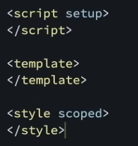

文件按照功能划分比按照类型划分 (html, css, js)更高效

header main footer

使用子组件的流程，导入组件，components中注册组件，在template中使用

难点1：

isDone的完整传递过程

父组件传出done属性，子组件接收done属性。

但是子组件不可以直接将其应用在checkbox的属性中，因为子组件只应该读父组件传的props，不应该修改父组件传的props，要保持单向流动。

因此子组件复制一份done的值到isDone

这样就可以指定:checked = "isDone"

难点2：
export default有什么
method是组件中可以使用的方法
data是数据仓库：定义组件的响应式数据的状态

由于读写实际的 DOM 节点通常比虚拟节点开销更大，虚拟 DOM 可以带来更好的性能。然而，这也意味着在使用框架时，你往往不应该直接通过原生浏览器 API（如 [`Document.getElementById`](https://developer.mozilla.org/zh-CN/docs/Web/API/Document/getElementById)）来编辑你的 HTML 元素，因为这会导致 VDOM 和真实 DOM 不同步。

Layout组件有一个<slot/>插槽，将外面的内容放进插槽中