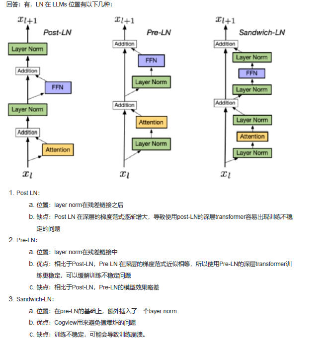

## prefix Decoder 和 causal Decoder 和 Encoder-Decoder 区别是什么？

**开场定框（30秒）：**

> "这三种架构的核心区别在于**注意力掩码（attention mask）的设计**，它决定了每个 token 能"看到"哪些位置，进而影响模型适合什么任务。我从注意力机制、结构、训练目标和适用场景四个维度来对比。"

---

**① Encoder-Decoder**

结构上是两个独立模块。==Encoder 对输入序列做**全双向注意力**，每个 token 都能看到整个输入；Decoder 对已生成序列做**因果掩码**==，同时通过 cross-attention 读取 Encoder 的表示。

训练目标是 seq2seq，输入和输出**显式分离**。参数量相对较大，但 Encoder 的双向编码对输入理解很深。代表模型是 T5、BART，适合翻译、摘要等**有明确输入输出边界**的任务。

---

**② Causal Decoder（因果解码器）**

只有一个 Decoder，对==**整个序列**==（包括 prompt）施加统一的因果掩码——==每个 token 只能看到它左侧的 token==。结构最简单，天然适合自回归生成，训练用 next-token prediction。

代表模型是 GPT 系列、LLaMA、Qwen。缺点是 prompt 部分也受因果约束，对输入的理解不如双向模型充分。适合通用对话、CoT 推理等**开放式生成**场景。

---

**③ Prefix Decoder（前缀解码器）**

==trade off。对 **prefix（输入/提示词）部分**使用双向注意力，对 **output（生成部分）**使用因果掩码。这样输入理解能力接近 Encoder，同时保留自回归生成的能力。==

代表模型是 GLM、ChatGLM、部分版本的 PaLM。优势是**用一个模型统一了编解码的能力**，适合指令跟随和条件生成。

==Encoder-Decoder 是物理隔离的双模块，通过 cross-attention 桥接；Prefix Decoder 是单模块内部用掩码实现的软性隔离==


## 涌现能力产生原因
"涌现能力这个问题学界目前有争议，我从两个角度来说。

一个观点认为它是真实的相变——复杂任务需要多个子能力同时到位，类似临界质量，小模型缺任何一块就全盘失败，大模型恰好全部具备后突然成功，数学上会呈现阶跃。

另一个观点（Schaeffer 2023）认为这是测量假象——用准确率这种二值指标时，线性增长的能力会在某个点突然'看起来'像阈值跃升；换成连续指标后涌现就消失了。

我个人倾向于认为两者都有道理，适用于不同类型的任务。对于简单任务，测量假象的解释更充分；对于多步推理这类组合性强的任务，真实相变更合理。目前这个问题还是 open question，工程上的启示是：小模型上跑不起来的能力，不一定是架构或数据问题，可能就是规模没到。"


## 为什么我们需要layer normalization

Layer Norm 让每层的输入保持稳定的分布，使得深层网络可以被高效训练


Layer Norm 做了两件事——**平移**（减均值）+ **缩放**（除标准差）。RMS Norm 的核心洞察是：平移这步（减均值）对模型效果贡献很小，去掉它可以省计算，同时保留缩放能力。

用均方根代替标准差，好处是不需要先计算均值，计算图更短，反向传播梯度更简洁。

## Layer normalization-位置篇
## LN 在 LLMs 中的不同位置 有什么区别么？
 Pre-Norm vs Post-Norm——现代 LLM 都用 Pre-Norm，把归一化放在子层输入之前而不是输出之后，主要原因是梯度更稳定，训练深层模型时不容易爆炸或消失。"

**Warmup** 是训练开始阶段，**先用很小的学习率，再逐渐增大到目标学习率**的一种学习率调度策略。
## Deepnorm


## FFN 块（Feed-Forward Network）

FFN 是 Transformer 里每个 encoder/decoder 层中，**紧跟在 Attention 之后**的那个子模块。

### 结构

每个 FFN 块其实就是一个两层 MLP：

```
FFN(x) = W₂ · activation(W₁x + b₁) + b₂
```

展开来说就是：**线性升维 → 非线性激活 → 线性降维**

- `W₁`：把维度从 `d_model` 升到 `d_ff`（通常是 4 倍，比如 512 → 2048）
- 激活函数：原始 Transformer 用 ReLU，现代模型（GPT、LLaMA）多用 **GELU 或 SwiGLU**
- `W₂`：再降回 `d_model`
### 为什么要升维再降维
### 1. 非线性变换需要"空间"才能发挥作用

核心矛盾是：**如果只用一个线性层，不管多宽，堆多少层，整体仍然是线性变换。**

非线性激活函数（ReLU/GELU）是模型表达能力的来源，但它只在**每个神经元维度上独立作用**。

升维的意义在于：把 `d_model` 维的向量投影到一个更大的空间里，激活函数在这个大空间里"雕刻"出复杂的非线性边界，然后再压缩回来。

直觉类比：

> 想象你要把一团纠缠在一起的线分开。在二维平面上可能根本分不开，但把它提升到三维空间，就可以轻松分离，再投影回二维。

这正是经典的**"升维解耦"**思想。

---

### 2. 信息瓶颈：压缩才能提取本质

升维之后必须降维，这个过程本身就是一种**有损压缩**。

- 升维时，模型把 token 的表示展开到高维，激活函数在里面做选择（ReLU 直接把负值清零，相当于稀疏选择）
- 降维时，模型被迫从这些激活中**提炼出真正有用的信息**，丢掉冗余

这个瓶颈结构（宽进窄出）迫使网络学到更紧凑、更本质的表示，而不是记住所有细节。
### 总结一张图

```
d_model (512)
    │
    │  W₁  【展开到高维，提供足够的"操作空间"】
    ▼
d_ff (2048)   ← 非线性激活在这里工作，稀疏选择有用的神经元
    │
    │  W₂  【压缩回来，提炼本质，丢掉冗余】
    ▼
d_model (512)
```


## Swish vs GELU 深度对比

### 本质区别：用什么来"门控"输入

两者的核心思想都是 **软性门控（soft gating）**——不像 ReLU 硬截断，而是用一个 0~1 之间的权重去缩放输入：

区别在于"门"的来源不同：

- Swish 用 **sigmoid**，计算简单，有成熟的 GPU 硬件加速
- GELU 用**标准正态 CDF**，有严格的概率论动机（输入被随机 mask 的期望），理论更优雅


## ### 交叉熵和KL散度本质区别

**交叉熵** H(P,Q)H(P,Q) H(P,Q) 衡量的是：用预测分布 QQ Q 来编码真实分布 PP P 的数据，平均需要多少 bits。它包含两部分信息：PP P 本身的复杂度（H(P)H(P) H(P)）+ QQ Q 偏离 PP P 的程度。

**KL 散度** DKL(P∥Q)D_{KL}(P\|Q) DKL​(P∥Q) 衡量的是：QQ Q 相对于 PP P 多花了多少额外 bits，即纯粹的"偏离量"，把 PP P 自身的复杂度减掉了。


loss使用交叉熵，那么我们假设数据服从类别分布，使用MSE代表其符合高斯分布


信息增益衡量的是：**知道特征 X的取值之后，目标变量 Y的不确定性减少了多少。**

IG(Y,X)=H(Y)−H(Y∣X)


### 在决策树中的应用

决策树（ID3 算法）在每个节点选择特征时，就是选**信息增益最大**的特征来分裂：

X∗=arg⁡max⁡XIG(Y,X)X^* = \arg\max_{X} IG(Y, X)X∗=argXmax​IG(Y,X)

每次分裂后子节点的纯度更高（熵更低），递归下去直到叶节点纯净或达到停止条件。


## 对比学习
对比学习是一种无监督学习方法，通过训练模型使得相同样本的表示更接近，不同样本的表示更远离，从而学习到更好的表示。对比学习通常使用对比损失函数，例如Siamese网络、Triplet网络等，用于学习数据之间的相似性和差异性。


## 大模型是怎么让生成的文本丰富而不单调的呢？
这道题考的是你能不能从"语言模型输出 logits"出发，一路讲到工程实践。以下是层层递进的完整回答逻辑：

**第一层——问题根源**

语言模型每一步输出的是词表上的 logit 向量，通过 softmax 转为概率分布。如果每次都选概率最高的 token（贪心解码），生成文本会陷入局部最优，产生重复、单调的结果。多样性的核心来源是**在采样阶段引入随机性**，同时控制这种随机性不至于失控。

**第二层——三大核心机制**

`Temperature`（温度缩放）是最基础的手段。在 softmax 之前把 logit 除以温度 τ：τ < 1 让分布更尖锐（更保守），τ > 1 让分布更平坦（更随机）。它控制的是整体"置信度"。

`Top-K 采样` 截断长尾：只保留概率最高的 K 个 token，其余设为 0，再对保留部分归一化后采样。缺点是 K 是固定的，不适应分布形状——分布很尖时 K=50 仍然引入大量噪声。

`Top-P / Nucleus 采样`（Holtzman et al., 2020）更优雅：动态选取累计概率恰好超过 P 的最小 token 集合。分布平坦时自动保留更多选项，分布尖锐时自动收窄——自适应截断。实践中 Top-P 通常比 Top-K 表现更稳定。

**第三层——工程叠加**

实际部署中三者叠加使用：先用 Temperature 调整分布形态，再用 Top-P（通常 0.9~0.95）截断尾部，最后按归一化后的概率随机采样。翻译、摘要等场景偏低温 + 小 P；创意写作偏高温 + 大 P。


## LLMs复读机问题
语言模型在自回归生成时，每一步都以已生成的序列作为上下文。一旦某个 token 或短语被生成，它就进入了上下文，而模型在训练中学到的统计规律会让它倾向于**继续生成与上下文相似的内容**——这是一个正反馈循环，一旦陷入就很难自行跳出。

极端情况下会出现"the the the the..."或"然后我就去了，然后我就去了，然后我就去了……"这样的退化输出（degenerate output）。
### 一、为什么会复读？

根本原因在于**自回归生成的条件依赖结构**。模型在训练语料中见过大量"高频词接高频词"的模式，加之贪心解码把每步都锁死在概率最高的 token，一旦某个词或短语出现，它就成为上下文，而模型的统计偏好会进一步强化同样的词——形成正反馈环路。

Holtzman et al.（2020）的论文把这种现象称为 **Neural Text Degeneration**，并定量证明了贪心解码和 Beam Search 在长序列上必然退化。

### 二、推理阶段：即插即用的方案

**Repetition Penalty（重复惩罚）**

最直接的工程手段。对已出现过的 token，在 logit 阶段直接做惩罚：

```
logit[t] = logit[t] / penalty    (若 logit > 0)
logit[t] = logit[t] × penalty    (若 logit < 0)
```

`penalty > 1` 就是惩罚，典型值 1.1～1.3。HuggingFace 的 `repetition_penalty` 参数直接控制这个。缺点是过大的惩罚会让模型回避正常需要重复的词（比如名字、专有名词）。

**Frequency Penalty 和 Presence Penalty**

OpenAI API 的两个参数，语义更精细：Presence Penalty 是"只要出现过就扣一次分"（鼓励话题多样），Frequency Penalty 是"出现越多扣越多"（抑制词汇层面的重复）。两者可以叠加使用。

**n-gram 阻断（no_repeat_ngram_size）**

硬规则：如果某个 n-gram 在历史中已经出现过，就把它的概率强制设为 0。HuggingFace `generate()` 里 `no_repeat_ngram_size=3` 就能开启。效果强但粗暴——翻译场景中同一实体名可能需要合法重复，这种方法会误杀。

**Temperature + Top-P**

上一问讲过，但和复读机的关系在于：贪心解码（τ→0）是复读机的温床，适度提高温度 + 用 Top-P 截断尾部，就能在每一步自然引入随机性，打破局部吸引子。

---

### 三、训练阶段：从根源修复

**Unlikelihood Training**（Welleck et al., 2020）

在损失函数里显式加入一项"不喜欢度"：除了最大化正确 token 的对数概率，还要最小化历史上已出现 token 的概率。损失变成：

L=LMLE+α∑t∑c∈Ct−log⁡(1−pθ(c∣x<t))\mathcal{L} = \mathcal{L}_{\text{MLE}} + \alpha \sum_{t} \sum_{c \in C_t} -\log(1 - p_\theta(c \mid x_{<t}))L=LMLE​+αt∑​c∈Ct​∑​−log(1−pθ​(c∣x<t​))

其中 CtC_t Ct​ 是候选"不喜欢"集合（通常是历史上下文中的词）。这从模型分布层面让重复 token 的概率系统性地低于正常水平。

**RLHF / RLAIF**

在对齐阶段，人类标注员（或 AI 裁判）对重复、啰嗦的输出给低分，奖励模型的梯度会自动将重复惩罚内化到参数中。这是目前生产级大模型（GPT-4、Claude 等）抑制复读机最主要的手段之一。


Logit 是语言模型输出层的**原始打分值**，softmax 之前的那个实数。